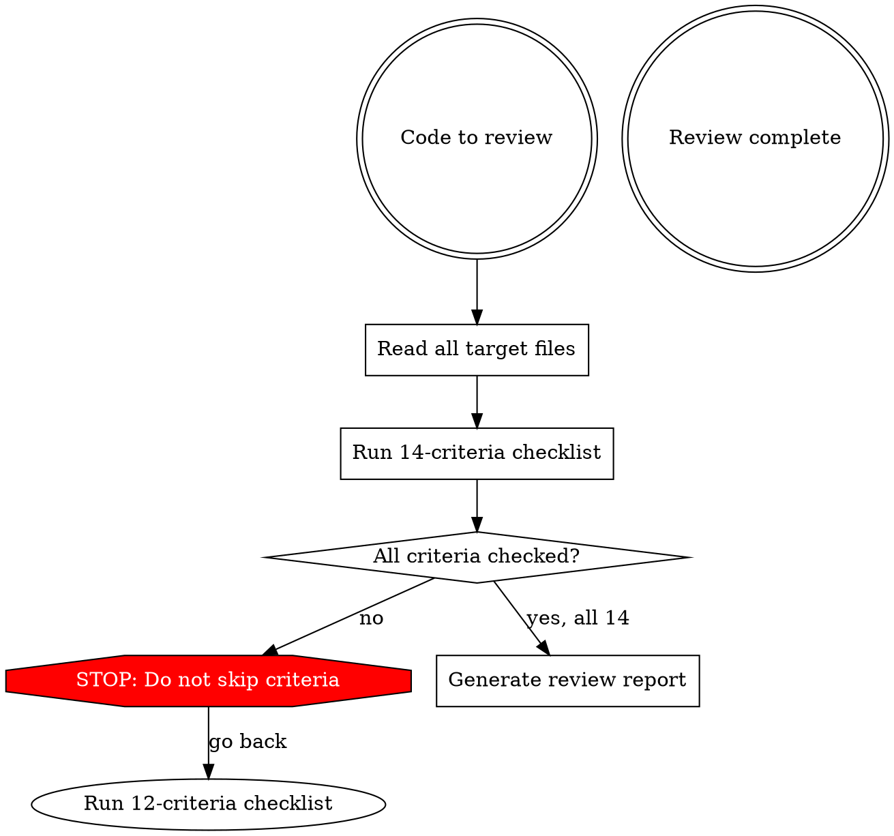

# Code Review

## Overview

Systematic code quality review against 14 concrete criteria. Every review MUST check ALL 14 criteria — no skipping, no "not applicable", no partial reviews.

## When to Use

- After implementing a feature or bugfix
- During PR review
- User requests code review or quality check
- Before merging to main branch
- When refactoring decisions are needed

**NOT for:** Bug hunting, security audits (those are separate concerns)

## Review Process



## The 12 Criteria

Review EACH file against ALL criteria. Report per-file results.

### 1. Readability — 코드가 직관적이고 이해 가능한가

- 코드를 처음 보는 사람이 5분 내 이해 가능한가
- 로직 흐름이 위에서 아래로 자연스럽게 읽히는가
- 주석 없이도 의도가 명확한가 (주석이 필요하면 코드가 불명확한 것)
- 한 줄이 하나의 의미 단위인가

**위반 예시:**
```typescript
// BAD: 읽는 사람이 멈춰서 해석해야 함
const r = items.filter(i => i.s === 1 && !i.d).map(i => ({ ...i, t: Date.now() }));

// GOOD: 의도가 바로 보임
const activeItems = items.filter(item => item.status === ACTIVE && !item.deleted);
const timestamped = activeItems.map(item => ({ ...item, updatedAt: Date.now() }));
```

### 2. OOP & SOLID 원칙 부합

- **S**: 클래스/모듈이 하나의 책임만 갖는가
- **O**: 확장에 열려있고 수정에 닫혀있는가
- **L**: 상속 시 부모를 대체 가능한가
- **I**: 사용하지 않는 인터페이스에 의존하지 않는가
- **D**: 구체 클래스가 아닌 추상에 의존하는가

**체크 방법:** 파일 하나가 여러 관심사를 다루면 SRP 위반. `if instanceof` 패턴이 반복되면 OCP 위반.

### 3. Naming — 함수명/변수명 규칙 (가장 중요한 기준)

> **핵심 원칙: 짧고 제네릭하면서 한 단어로 자기 자신을 깔끔하게 설명해야 한다.**
> 좋은 이름은 코드를 읽는 사람이 "이게 뭐하는 거지?" 라고 멈추지 않게 한다.

**규칙:**
- 최대 12자 (camelCase 기준, 접두사 제외)
- 줄임말 절대 금지 (`msg` → `message`, `btn` → `button`, `req` → `request`, `res` → `response`, `cfg` → `config`, `ctx` → `context`, `err` → `error`, `cb` → `callback`)
- 이름만 보고 역할을 알 수 있어야 함

#### 3-A. 함수명 — 짧고 제네릭하고 자기설명적

**최우선 규칙:** 함수명은 **한 단어(동사)** 또는 **동사+명사 최소 조합**으로, 그 함수가 뭘 하는지 즉시 알 수 있어야 한다.

| 원칙 | 설명 | BAD | GOOD |
|------|------|-----|------|
| **한 단어 동사** | 가능하면 동사 하나로 | `performInitialization()` | `Initialize()` |
| **제네릭** | 특정 구현이 아닌 의도를 표현 | `removeFromListAndCleanup()` | `Remove()` |
| **자기설명적** | 이름만으로 역할이 명확 | `doWork()`, `process()` | `Recalculate()`, `Dispatch()` |
| **12자 미만** | 간결함 우선 | `calculateAndApplyDamage()` | `ApplyDamage()` |
| **구체적 맥락 불필요** | 클래스가 맥락을 제공 | `StatModule.recalculateStat()` | `StatModule.Recalculate()` |

**함수명 위반 체크리스트:**
1. **이름에 클래스명 반복?** → `EquipmentModule.EquipEquipment()` ❌ → `Equip()` ✅
2. **And/Or/With 포함?** → 함수 분리 필요 신호
3. **동사 없이 명사만?** → getter가 아니면 동사 필수
4. **3단어 이상?** → 2단어 이하로 줄일 수 있는지 검토
5. **뭘 하는지 5초 안에 파악 불가?** → 이름 변경 필요

```csharp
// BAD: 너무 길고 구체적
void HandleEquipmentStatChangeAndNotifyUI() { }
void ProcessAndValidateDropTableResults() { }
void UpdateBlackboardTargetPositionData() { }

// GOOD: 짧고 제네릭하면서 자기설명적
void Recalculate() { }    // StatModule 안이면 "스탯 재계산" 맥락 자명
void Roll() { }            // DropTable 안이면 "드롭 굴림" 맥락 자명
void Track() { }           // TargetTracker 안이면 "타겟 추적" 맥락 자명
void Bind() { }            // EquipmentModule 안이면 "장비 바인딩" 맥락 자명
void Sync() { }            // 데이터 동기화 맥락 자명
void Dispatch() { }        // CommandHandler 안이면 "커맨드 디스패치" 맥락 자명
```

**리뷰 시 반드시 확인:**
- 모든 public/protected 함수명을 나열하고 12자 초과 여부 체크
- 각 함수명이 "한 단어로 설명 가능한가?" 자문
- 클래스 맥락을 고려했을 때 이름이 과도하게 구체적이지 않은가?

#### 3-B. 변수명 — 짧고 명확

| 원칙 | BAD | GOOD |
|------|-----|------|
| 타입이 맥락을 제공 | `MonsterData monsterDataInstance` | `MonsterData data` |
| 역할만 표현 | `float moveSpeedValue` | `float speed` |
| 12자 미만 | `cachedRenderersList` | `renderers` |
| 줄임말 금지 | `ctx`, `em`, `pos`, `dist` | `context`, `entityManager`, `position`, `distance` |
| bool은 is/has/can | `bool dead` | `bool isDead` |

#### 3-C. 줄임말 금지 목록

| 줄임말 | 올바른 표기 |
|--------|------------|
| `msg` | `message` |
| `btn` | `button` |
| `req` | `request` |
| `res` | `response` |
| `cfg` | `config` |
| `ctx` | `context` |
| `err` | `error` |
| `cb` | `callback` |
| `val` | `value` |
| `idx` | `index` |
| `tmp` | `temp` / 이름 변경 |
| `num` | `count` / `total` |
| `str` | `text` / `name` |
| `obj` | 구체적 이름 사용 |
| `fn` | `handler` / 구체적 이름 |
| `args` | `params` 또는 구체적 이름 |
| `info` | 구체적 이름 사용 |
| `pos` | `position` |
| `dist` | `distance` |
| `em` | `entityManager` / `manager` |

#### 3-D. 네이밍 리뷰 보고 형식

리뷰 시 반드시 아래 형식으로 함수명/변수명 목록을 작성:

```markdown
**함수명 검증:**
| 함수명 | 글자수 | 제네릭? | 자기설명? | 판정 |
|--------|--------|---------|-----------|------|
| Initialize | 10 | ✅ | ✅ | ✅ |
| HandleStatChangeAndNotify | 25 | ❌ 과도 | ⚠️ | ❌ 12자+ |
| Get | 3 | ✅ | ⚠️ 모호 | ⚠️ |

**변수명 줄임말 검사:**
| 변수 | 위치 | 위반 | 수정 |
|------|------|------|------|
| ctx | file.cs:50 | 줄임말 | context |
```

### 4. No Redundancy & Zero Boilerplate — 중복과 보일러플레이트가 없는가

- 동일 로직이 2곳 이상에서 반복되지 않는가
- 불필요한 래핑 함수 (단순 위임만 하는 함수) 없는가
- 같은 데이터를 여러 번 fetch/compute 하지 않는가
- 사용되지 않는 함수 호출이 없는가

**보일러플레이트 탐지 — 0에 수렴시켜야 한다:**

> **핵심 원칙: 동일한 구조(패턴)가 3개 이상의 클래스에서 반복되면, 그것은 base class/제네릭/데이터 주도 설계로 흡수해야 할 보일러플레이트다.**
> "클래스마다 다른 값"은 반복의 면죄부가 아니다 — 값만 다르고 구조가 같으면 데이터로 분리해야 한다.

**보일러플레이트 체크리스트:**
1. **필드 쌍 반복**: `flatXBonus` / `percentXBonus` 같은 쌍이 여러 클래스에 존재 → Dictionary/Map으로 통합
2. **공식 반복**: `(base + flat) * (1 + percent / 100)` 같은 동일 계산식이 N개 프로퍼티에 복사 → base class의 `Resolve(key, base)` 메서드로 통합
3. **switch 분기 반복**: 여러 subclass에서 동일한 switch 구조를 override → base class가 데이터 기반으로 자동 처리
4. **초기화 반복**: 필드별 `= 0` 리셋이 N줄 → 컬렉션 `.Clear()` 한 줄로 대체

**위반 예시:**
```csharp
// BAD: 14개 클래스에서 이 패턴 반복 (stat 1개당 9줄 보일러플레이트)
[NonSerialized] private float flatRangeBonus;
[NonSerialized] private float percentRangeBonus;
public float FinalRange => (range.value + flatRangeBonus) * (1f + percentRangeBonus / 100f);
// + ApplyOption switch 4줄 + ResetBonuses 2줄 = stat당 9줄

// GOOD: base class에 데이터 주도 메커니즘, subclass는 프로퍼티 1줄만
public float FinalRange => (float)bonuses.Resolve(OptionStat.Range, range.value);
// ApplyOption, ResetBonuses는 base class가 자동 처리 → override 불필요
```

**측정 기준:**
- stat/옵션 1개 추가 시 **2줄 이하**(프로퍼티 선언 + enum 값)면 ✅
- stat/옵션 1개 추가 시 **3줄 이상** 필요하면 ⚠️ 보일러플레이트
- 동일 패턴이 **3개 클래스 이상**에서 반복되면 ❌ 즉시 추상화 대상

**보고 형식:**
```markdown
**보일러플레이트 검사:**
| 패턴 | 반복 횟수 | 클래스 수 | 줄 수/회 | 총 줄 | 제거 방법 |
|------|-----------|-----------|----------|-------|-----------|
| flat/percent 보너스 필드 | 24쌍 | 11 | 2줄 | 48줄 | Dictionary<OptionStat, Bonus> |
| ApplyOption switch | 30분기 | 14 | 4줄 | 120줄 | base class 자동 라우팅 |
```

### 5. File Length — 파일 하나 200-300줄 미만

- 파일이 300줄 초과하면 **반드시** 분리 필요 지적
- 200-300줄이면 경고 수준
- 200줄 미만이 이상적

**보고 형식:** `파일명: N줄 (✅ / ⚠️ 200-300 / ❌ 300+)`

### 6. Function Single Responsibility — 함수가 하나의 일만 하는가

- 함수 길이 20줄 이하
- side effect 없음 (또는 이름에 명시)
- 함수 이름이 "and"를 포함하면 분리 대상
- 한 함수에서 2가지 이상 추상화 레벨을 다루지 않는가

**위반 신호:**
- 함수 안에 빈 줄로 구분된 "단계"가 있음
- 주석으로 `// Step 1`, `// Step 2` 같은 구분이 필요함
- `validateAndSave()`, `fetchAndProcess()` 같은 이름

### 7. No Magic Numbers/Strings — 매직 넘버/스트링 없는가

- 리터럴 숫자가 의미 없이 사용되지 않는가 (`0`, `1`, `-1`, `""`, `true/false` 제외)
- 하드코딩된 문자열이 반복되지 않는가
- 상수로 추출해야 하는 값이 인라인으로 있지 않는가

```typescript
// BAD
if (status === 3) { ... }
setTimeout(fn, 86400000);
if (role === "admin") { ... }  // 여러 곳에서 반복

// GOOD
if (status === STATUS_COMPLETE) { ... }
setTimeout(fn, ONE_DAY_MS);
if (role === ROLE_ADMIN) { ... }
```

### 8. Error Handling — 에러 처리가 적절한가

- `catch {}` (빈 catch) 절대 금지
- 에러를 삼키지 않는가 (최소한 로깅)
- 에러 타입별 적절한 처리가 있는가
- 사용자에게 에러 상태를 보여주는가 (UI 코드의 경우)

**위반 패턴:**
```typescript
// BAD: silent catch
try { ... } catch (e) { }
try { ... } catch { }
try { ... } catch (e) { console.log(e); }  // log만 하고 처리 안함

// GOOD
try { ... } catch (error) {
  logger.error('Operation failed', { error, context });
  throw new AppError('User-facing message', { cause: error });
}
```

### 9. No Circular Dependencies — 순환 의존성 없는가

- A → B → A 패턴 없는가
- import 그래프가 단방향인가
- 모듈 간 의존성이 명확한 계층 구조를 따르는가

**체크 방법:** 파일의 import 목록을 확인하고, 상호 참조가 없는지 검증.

### 10. Type Safety — 타입 안전성

- TypeScript: `any` 사용 금지 (불가피한 경우 주석 필수)
- Python: `Optional` 타입 힌트가 적절한가
- `null`/`undefined` 가능성이 있는 곳에 guard가 있는가
- 타입 단언(`as`)이 남용되지 않는가

### 11. No Dead Code — 죽은 코드 없는가

- 주석처리된 코드 블록 없는가
- 사용되지 않는 import 없는가
- 사용되지 않는 변수/함수 없는가
- `// TODO` 주석과 함께 방치된 코드 없는가

### 12. No Deep Nesting — 깊은 중첩 없는가

- `if`/`for`/`while` 3단 이상 중첩 금지
- early return으로 해결 가능한 중첩이 있는가
- 중첩 대신 함수 추출이 필요한가

```typescript
// BAD: 3단 중첩
function process(items) {
  for (const item of items) {
    if (item.active) {
      if (item.type === 'special') {
        if (item.value > 0) {
          // ... logic
        }
      }
    }
  }
}

// GOOD: early return + 추출
function process(items) {
  const special = items.filter(item => item.active && item.type === 'special');
  special.forEach(item => processItem(item));
}

function processItem(item) {
  if (item.value <= 0) return;
  // ... logic
}
```

### 13. Hot Path Optimization — 매 프레임 실행 코드가 최적화되어 있는가

> **핵심 원칙: Update/LateUpdate/FixedUpdate 등 매 프레임 호출되는 코드는 할당과 동기화 비용에 민감하다.**
> 한 번만 실행되는 초기화 코드와 매 프레임 코드는 다른 기준으로 평가해야 한다.

**체크 항목:**
- **GC Allocation**: 매 프레임 `new List()`, `new Dictionary()`, LINQ `.ToList()`, 문자열 결합 등 힙 할당이 없는가
- **Sync Point (ECS/DOTS)**: `EntityManager.GetComponentData()` 등 개별 접근이 매 프레임 발생하는가 → 배치 쿼리(`ToComponentDataArray`)나 Bridge 패턴으로 최적화되어야 함
- **Structural Change (ECS/DOTS)**: `AddComponent`, `RemoveComponent`, `CreateEntity`, `DestroyEntity`가 매 프레임 호출되지 않는가 → 초기화/정리 시점에만 허용
- **Physics API 남용**: `GetComponent`, `FindObjectOfType`, `Camera.main` 등 매 프레임 호출되지 않는가 → 캐싱 필수
- **불필요한 반복 계산**: 프레임마다 동일한 결과를 재계산하지 않는가 → 값이 변할 때만 갱신 (dirty flag 등)

**위반 예시:**
```csharp
// BAD: Update에서 매 프레임 GC + 개별 ECS 접근
void Update() {
    var targets = new List<Unit>();                          // GC 매 프레임
    var em = World.DefaultGameObjectInjectionWorld.EntityManager;
    var data = em.GetComponentData<MyData>(entity);          // Sync point 매 프레임
    var cam = Camera.main;                                   // FindObjectOfType 매 프레임
}

// GOOD: 캐싱 + 배치 처리
private List<Unit> targets = new();      // 재사용
private Camera mainCamera;               // 캐싱

void Start() { mainCamera = Camera.main; }

void Update() {
    targets.Clear();                     // 재사용 (GC 없음)
    // ECS 데이터는 Bridge에서 배치 동기화
}
```

**ECS/DOTS 전용 체크리스트:**
1. **개별 EntityManager 접근이 N회 반복?** → BatchProcessor / Bridge 패턴으로 2-3회로 줄여야 함
2. **Trajectory/물리 계산이 MonoBehaviour Update에?** → DOTS System(Burst) + Bridge sync가 올바른 패턴
3. **Entity 생성/파괴가 런타임 루프에?** → 풀링 또는 초기화 시점으로 이동
4. **NativeArray를 매 프레임 Allocate?** → Persistent로 한 번 할당, Clear 재사용

**보고 형식:**
```markdown
**Hot Path 검사:**
| 위치 | 호출 빈도 | 문제 유형 | 심각도 | 수정 방향 |
|------|-----------|-----------|--------|-----------|
| Update():45 | 매 프레임 | GC Alloc (new List) | ❌ | 필드로 캐싱 후 Clear 재사용 |
| Update():50 | 매 프레임 | Sync Point (GetComponentData) | ❌ | Bridge 배치 처리 |
| OnSpawn():77 | 1회/생성 | Structural Change (AddComponent) | ✅ | 초기화 1회만이므로 허용 |
```

### 14. Resource & Lifecycle — 리소스 수명 관리가 적절한가

> **핵심 원칙: 생성한 것은 반드시 정리하고, 구독한 것은 반드시 해제해야 한다.**

**체크 항목:**
- **IDisposable**: `IDisposable` 구현체가 `Dispose()`를 올바르게 호출하는가 (NativeArray, CancellationTokenSource, Stream 등)
- **이벤트 구독 해제**: `OnEnable/OnDisable` 또는 `Subscribe/Unsubscribe` 쌍이 맞는가
- **풀링 반환**: 풀에서 가져온 객체가 모든 경로(정상 + 예외)에서 반환되는가
- **비동기 수명**: `async`/`UniTask` 작업이 객체 파괴 후에도 실행될 수 있는가 → `CancellationToken` 필수
- **NativeContainer 누수**: DOTS `NativeArray`, `NativeList`, `BlobAssetReference` 등이 적절히 Dispose되는가

**위반 예시:**
```csharp
// BAD: CTS 누수 + 파괴 후 async 실행 가능
private CancellationTokenSource cts;
void OnSpawn() {
    cts = new CancellationTokenSource();
    DoWork().Forget();  // 파괴 후에도 실행될 수 있음
}
// cts.Dispose() 호출 없음!

// GOOD: 정리 보장
void OnSpawn() {
    cts = new CancellationTokenSource();
    DoWork(cts.Token).Forget();
}
void OnDespawn() {
    cts?.Cancel();
    cts?.Dispose();
    cts = null;
}
```

**풀링 반환 체크리스트:**
1. **모든 분기에서 반환?** → early return, 예외 경로에서도 `ReturnSignal`/`Despawn` 호출 확인
2. **Clone 후 원본 정리?** → Clone으로 생성된 context/signal이 정리되는가
3. **비동기 작업 중 풀 반환?** → `await` 전에 반환하면 다른 곳에서 재사용될 위험

**보고 형식:**
```markdown
**리소스 수명 검사:**
| 리소스 | 생성 위치 | 정리 위치 | 판정 |
|--------|-----------|-----------|------|
| CancellationTokenSource | OnSpawn:51 | OnDespawn:99 | ✅ Cancel+Dispose |
| NativeArray<Entity> | Read:102 | Write:153 | ✅ Dispose |
| ExecutionContext (Clone) | OnHit:254 | — | ⚠️ Dispose 미호출 |
```

## Report Format

리뷰 결과를 아래 형식으로 보고:

```markdown
## Code Review Report

### File: `path/to/file.ts` (N줄)

| # | Criteria | Result | Details |
|---|----------|--------|---------|
| 1 | Readability | ✅/⚠️/❌ | 구체적 지적 |
| 2 | OOP & SOLID | ✅/⚠️/❌ | 구체적 지적 |
| 3 | Naming (12자, 줄임말 금지) | ✅/⚠️/❌ | 위반 목록 |
| 4 | No Redundancy | ✅/⚠️/❌ | 구체적 지적 |
| 5 | File Length | ✅/⚠️/❌ | N줄 |
| 6 | Function SRP (20줄) | ✅/⚠️/❌ | 위반 함수 목록 |
| 7 | No Magic Numbers | ✅/⚠️/❌ | 위반 목록 |
| 8 | Error Handling | ✅/⚠️/❌ | 구체적 지적 |
| 9 | No Circular Deps | ✅/⚠️/❌ | 구체적 지적 |
| 10 | Type Safety | ✅/⚠️/❌ | 위반 목록 |
| 11 | No Dead Code | ✅/⚠️/❌ | 위반 목록 |
| 12 | No Deep Nesting | ✅/⚠️/❌ | 위반 위치 |
| 13 | Hot Path Optimization | ✅/⚠️/❌ | GC/Sync/Structural 위반 목록 |
| 14 | Resource & Lifecycle | ✅/⚠️/❌ | Dispose/구독해제/풀반환 위반 목록 |

### Summary
- ❌ Critical (즉시 수정): [목록]
- ⚠️ Warning (개선 권장): [목록]
- ✅ Pass: N/14 criteria
```

## Red Flags — STOP and Re-check

이런 생각이 들면 기준을 건너뛰려는 것:

| Thought | Reality |
|---------|---------|
| "이 파일은 간단해서 전부 안 봐도 됨" | 14개 전부 체크. 간단한 파일도 네이밍 위반 있음 |
| "네이밍은 주관적이라 넘어가겠음" | 12자, 줄임말 금지는 객관적 규칙. 측정 가능함 |
| "이 정도 중첩은 괜찮음" | 3단 이상이면 무조건 지적. 예외 없음 |
| "프레임워크 코드라 어쩔 수 없음" | 프레임워크 제약이라도 개선 가능한 부분 지적 |
| "버그가 아니라 품질 문제라 덜 중요함" | 이 스킬의 목적이 품질 리뷰. 버그 헌팅이 아님 |
| "파일이 290줄이라 거의 300줄 미만" | 200-300 범위면 ⚠️ 경고 필수 |
| "catch에 console.log 있으니 처리한 것" | log만 하고 throw/return 없으면 ❌ |
| "각 클래스마다 값이 다르니 중복 아님" | 구조가 같고 값만 다르면 데이터로 분리해야 할 보일러플레이트. 3개 클래스 이상이면 ❌ |
| "OnSpawn에서 한 번만 호출되니 괜찮음" | 초기화 1회는 OK. 하지만 N개 동시 spawn이면 N회 structural change — 빈도 확인 필수 |
| "Update 안의 new는 소량이라 괜찮음" | 60fps × N개 객체 = 초당 수백 회 할당. GC spike 원인 |
| "Dispose 안 해도 GC가 처리함" | NativeArray, CTS, BlobAssetReference는 GC 대상 아님. 명시적 Dispose 필수 |
| "풀에서 꺼냈는데 에러 경로에서 반환 안 해도 됨" | 풀 누수 → 메모리 증가 + 풀 고갈. 모든 경로에서 반환 필수 |

## Common Mistakes

1. **버그/보안에 집중하고 품질 기준 건너뜀** — 이 스킬은 코드 품질 전용. 버그는 별도.
2. **네이밍 리뷰 생략** — baseline 테스트에서 가장 많이 건너뛴 항목. 반드시 체크.
3. **"Not applicable" 남발** — 14개 중 해당 없음은 거의 없음. OOP가 없는 스크립트라도 함수 SRP, 네이밍은 적용됨.
4. **파일 줄 수를 정확히 세지 않음** — 반드시 실제 줄 수를 확인하고 보고.
5. **severity만 보고하고 구체적 위치/수정 방법 없음** — 라인 번호와 수정 제안 필수.
6. **Hot path 분석 시 호출 빈도 구분 실패** — `OnSpawn`(1회)과 `Update`(매 프레임)의 최적화 기준이 다름. 함수가 어디서 호출되는지 반드시 추적.
7. **ECS 프로젝트에서 sync point/structural change 무시** — DOTS 코드가 있으면 반드시 13번 기준으로 Bridge/배치 처리 여부 확인.
