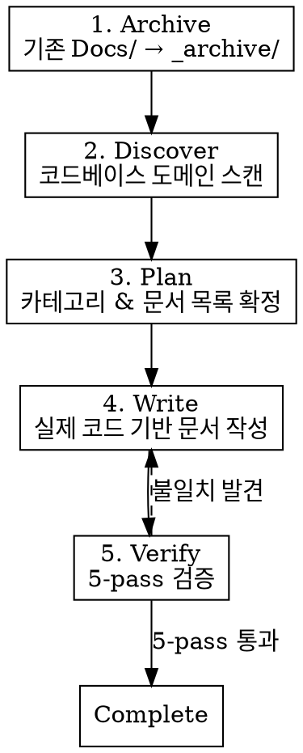
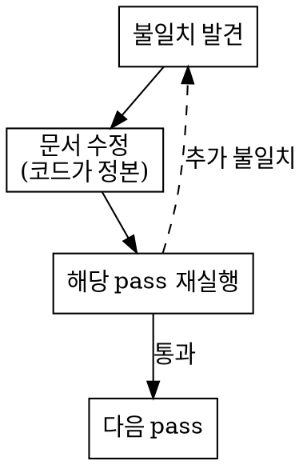

# Technical Documentation Generator

## Overview

코드베이스의 실제 구현을 기반으로 프로페셔널 기술문서를 생성한다. 모든 문서는 실제 코드에서 직접 추출한 사실만 기술하며, 감정/사견/추측을 포함하지 않는다. 5-pass 검증으로 코드와 문서 간 불일치를 0건으로 보장한다.

## When to Use

- 프로젝트 기술문서 전체 생성 또는 갱신
- 새로운 시스템/모듈 문서화
- 기존 문서와 코드 간 동기화 필요
- 온보딩용 아키텍처 문서 작성

**When NOT to use:**
- 블로그/포트폴리오 → `blog-writing`, `portfolio-writing`
- 게임디자인 문서 (기획서) → 별도 관리
- 단일 함수 설명 → 코드 주석으로 충분

## Core Workflow



## Phase 1: Archive

기존 `Docs/` 하위 문서를 보존한다.

```
Docs/
├── _archive/           ← 기존 문서 전체 이동
│   ├── System/         ← 원본 구조 유지
│   └── ...
├── {Domain}/           ← 새 문서
```

**규칙:**
- `Docs/_archive/` 생성 후 기존 문서를 원본 디렉토리 구조 그대로 이동
- GameDesign/ 등 기술문서가 아닌 폴더는 이동 대상 아님 (사용자 확인)
- `_archive/` 내부는 수정하지 않음

## Phase 2: Discover

코드베이스를 스캔하여 도메인을 식별한다.

**도메인 식별 기준:**
1. 스크립트 디렉토리 최상위 폴더 (`Units/`, `UI/`, `System/` 등)
2. 독립적 기능 단위 (자체 데이터/로직/인터페이스를 가진 모듈)
3. namespace 또는 폴더 경계

**수행 작업:**
- `find` 또는 `Glob`으로 전체 스크립트 디렉토리 트리 추출
- 각 도메인의 핵심 클래스, 진입점, 의존성 파악
- 도메인 간 의존 관계 맵 구성

## Phase 3: Plan

사용자에게 문서 구조를 제시하고 확인받는다.

**출력 폴더 구조:**
```
Docs/
├── Architecture/
│   └── Overview.md              ← 전체 시스템 아키텍처
├── {Domain}/
│   ├── Overview.md              ← 도메인 개요 + 내부 구조
│   └── {System}.md              ← 개별 시스템 상세
```

**Plan 출력 형식:**
```
## 문서 계획

### Architecture/
- Overview.md: 전체 시스템 의존성 맵, 데이터 흐름, 레이어 구조

### Combat/
- Overview.md: 전투 시스템 전체 구조
- DamageFormula.md: 데미지 계산 파이프라인
- Beam.md: 빔 시스템 (V3D 통합, 레이캐스트)

### AI/
- Overview.md: BT 아키텍처, 평가 루프
- BehaviourTree.md: 스택 기반 순회, 노드 타입
- CommandPipeline.md: 커맨드 디스패치 흐름
...
```

**사용자 확인 후 진행.** 카테고리 추가/삭제/병합 반영.

## Phase 4: Write

### 작성 규칙 (Iron Rules)

**절대 금지:**
- 감정/평가 표현: "효율적인", "우아한", "강력한", "잘 설계된", "핵심", "중요한", "뛰어난", "최적화된"
- 추측: "아마도", "~인 것 같다", "~일 수 있다"
- 사견: "~하는 것이 좋다", "추천한다", "이상적으로는"
- 허구: 실제 코드에 없는 클래스명, 메서드명, 파라미터
- 생략된 코드: `// ...` 으로 코드 생략 금지 (필요한 부분만 정확히 발췌)

**필수 준수:**
- 모든 클래스명, 메서드명, 필드명은 실제 코드에서 직접 복사
- 파일 경로는 프로젝트 루트 기준 상대경로 (`Assets/Core/Scripts/...`)
- 코드 블록 상단에 파일 경로 명시
- 데이터 흐름은 실제 호출 체인 기반으로 기술
- 의존성은 실제 `using`, 필드 참조, 메서드 호출로 검증
- **모든 도식화는 반드시 mermaid 차트로 작성한다** — ASCII art, 텍스트 박스, dot/graphviz, 들여쓰기 트리 등 다른 형식 사용 금지. 클래스 계층은 `classDiagram`, 흐름은 `flowchart`/`graph`, 시퀀스는 `sequenceDiagram`, 상태는 `stateDiagram-v2`를 사용한다.
- **핵심 로직 코드 스니펫 필수 포함** — 각 시스템/모듈 문서에는 해당 시스템의 핵심 알고리즘이나 로직을 담은 실제 코드 발췌가 포함되어야 한다. 단순 클래스 선언이나 시그니처만 나열하는 것은 코드 스니펫이 아니다. 아래 기준에 해당하는 코드를 실제 소스에서 발췌하여 포함한다:
  - **계산/알고리즘**: 데미지 공식, 인덱스 계산, 모디파이어 적용, 확률 롤링 등 수식이 있는 로직
  - **상태 전이**: 초기화 시퀀스, 라이프사이클 메서드, 상태 변경 분기 (if/switch)
  - **데이터 변환**: 입력→출력 변환, 직렬화/역직렬화, 매핑 로직
  - **이벤트/콜백 연결**: subscribe/invoke 패턴, 핸들러 디스패치
  - **조건 분기**: 필터링, 검증, 가드 절 등 비즈니스 규칙이 코드에 표현된 부분
  - 단, getter/setter만 있는 프로퍼티, 빈 메서드, 단순 위임(delegate call) 등 로직이 없는 코드는 포함하지 않는다

### 문서 템플릿

#### Architecture/Overview.md
```markdown
# Architecture Overview

## System Map
[도메인 간 의존성 다이어그램 — 반드시 mermaid chart]

## Layer Structure
[Core, Runtime, Presentation 등 레이어 설명]

## Data Flow
[주요 데이터 흐름 경로 — 입력 → 처리 → 출력]

## Domain Summary
| Domain | Entry Point | Core Responsibility |
|--------|------------|---------------------|
| ...    | ...        | ...                 |
```

#### {Domain}/Overview.md
```markdown
# {Domain Name}

## Purpose
[이 도메인이 하는 일 — 1~2문장, 사실만]

## Architecture
[내부 구조 다이어그램 또는 클래스 관계]

## Key Components
| Class | File | Role |
|-------|------|------|
| ...   | ...  | ...  |

## Dependencies
- Depends on: [실제 참조하는 외부 도메인]
- Depended by: [이 도메인을 참조하는 외부 도메인]

## Data Flow
[입력 → 처리 → 출력 체인]
```

#### {Domain}/{System}.md
```markdown
# {System Name}

## Overview
[시스템 목적 — 1문장]

## Architecture
[클래스 구조, 상속/구성 관계]

## Core API
[public 메서드/프로퍼티 — 시그니처 + 역할]

## Internal Flow
[실행 흐름 — 메서드 호출 순서]

## Data Structures
[핵심 데이터 클래스/구조체 — 필드 목록]

## Integration Points
[다른 시스템과의 연결점 — 이벤트, 콜백, 직접 참조]
```

### 작성 순서

1. **Architecture/Overview.md** 먼저 (전체 그림)
2. 각 도메인의 **Overview.md** (도메인별 그림)
3. 각 도메인의 **개별 시스템 문서** (상세)

각 문서 작성 시:
1. 해당 도메인의 모든 소스 파일을 읽는다 (Serena 심볼 탐색 또는 직접 Read)
2. 클래스 계층, public API, 내부 흐름을 코드에서 직접 추출한다
3. 코드에서 확인된 사실만 문서에 기술한다

## Phase 5: Verify (5-Pass)

**5개 pass 전부 실행 필수. 단축/스킵/병합 금지.**
**모든 pass는 실제 코드 대조 필수. 기억이나 추측으로 검증하지 않는다.**
**각 pass 완료 후 결과를 명시적으로 출력한다: `[Pass N] 검증 항목 X건, 불일치 Y건`**

### Pass 1: Code Reference Accuracy
- 문서에 언급된 모든 클래스명 → `Grep`/`Glob`으로 실제 존재 확인
- 문서에 언급된 모든 메서드명 → 실제 시그니처와 대조
- 문서의 코드 블록 → 실제 소스 파일의 해당 라인과 비교
- 파일 경로 → 실제 파일 시스템에서 존재 확인

### Pass 2: Architecture Accuracy
- 의존성 화살표 → 실제 `using` 문, 필드 타입, 메서드 호출로 검증
- 데이터 흐름 → 실제 호출 체인 추적 (A→B→C가 코드에서 실제로 그런지)
- 상속/구현 관계 → 실제 클래스 선언에서 확인
- 이벤트/콜백 연결 → 실제 subscribe/invoke 코드 확인

### Pass 3: Completeness
- 각 도메인의 public 클래스 중 문서에 누락된 것 확인
- 주요 public API (public 메서드) 중 문서에 빠진 것 확인
- 도메인 간 연결점 중 문서화되지 않은 것 확인
- Overview의 Domain Summary에 모든 도메인이 포함되었는지 확인

### Pass 4: Consistency
- 동일 클래스/메서드가 여러 문서에서 같은 이름으로 표기되는지
- 파일 경로 형식 통일 (상대경로, 구분자)
- 문서 간 상호참조 링크가 실제 파일을 가리키는지
- 용어 통일 (같은 개념에 같은 단어 사용)

### Pass 5: Newcomer Readability
- Architecture/Overview.md만 읽고 전체 시스템 구조를 파악할 수 있는지
- 각 Domain/Overview.md만 읽고 해당 도메인의 역할과 구조를 이해할 수 있는지
- 전문 용어에 대한 첫 등장 시 설명이 있는지
- 문서 간 탐색 경로가 자연스러운지 (Overview → Detail)

### Pass 6~8: Markdown & Mermaid 포맷 검수 (3회 반복 필수)

**3회 전부 실행 필수. "이미 확인했으니 스킵" 금지.**
매 회차마다 전체 문서를 다시 읽고 아래 항목을 검증한다. 각 회차 완료 후 결과를 명시적으로 출력한다: `[Format Pass N/3] 검증 항목 X건, 오류 Y건`

**검증 항목:**

#### Mermaid 문법 검증
- 모든 `\`\`\`mermaid` 블록이 `\`\`\``로 정상 종료되는지
- `flowchart TD`/`LR`, `classDiagram`, `stateDiagram-v2`, `sequenceDiagram` 등 유효한 차트 타입인지
- 노드 ID에 공백, 특수문자(`<`, `>`, `&`, `"`) 포함 시 `["..."]` 또는 HTML entity(`&lt;`, `&gt;`, `&amp;`)로 이스케이프 되었는지
- 화살표 문법 정확성: `-->`, `-->|label|`, `<-->`, `-.->` 등
- `subgraph` 사용 시 `end`로 정상 닫히는지
- `classDiagram`에서 `<|--`, `*--`, `o--` 등 관계 화살표 문법이 정확한지
- 제네릭 타입 표기: `~T~` 사용 (mermaid에서 `<T>`는 HTML로 해석됨)
- 노드 텍스트에 괄호 `()` 사용 시 `["..."]`로 감싸야 mermaid 파싱 오류 방지

#### Markdown 포맷 검증
- 헤딩(`#`, `##`, `###`) 전후에 빈 줄이 있는지
- 코드 블록(`\`\`\`csharp`, `\`\`\`mermaid`) 열기/닫기 짝이 맞는지
- 테이블 구분선(`|---|`)이 헤더 아래에 정확히 있는지
- 테이블 열 수가 헤더와 본문 행에서 일치하는지
- 리스트 항목 들여쓰기가 일관적인지 (2칸 또는 4칸)
- 링크 `[text](path)` 형식에서 path가 유효한지
- 빈 줄 없이 연속된 블록(코드→테이블, 헤딩→코드 등)이 없는지

#### 렌더링 안전성 검증
- `<` `>` 문자가 코드 블록 바깥에서 HTML 태그로 오인될 가능성 확인 → 백틱 또는 이스케이프
- mermaid 노드 텍스트 내 `\n` 사용 시 실제 줄바꿈이 의도대로 동작하는지 (일부 렌더러에서 미지원)
- 중첩 코드 블록(코드 블록 안의 코드 블록)이 없는지

**3회 반복 이유:** 1회차에서 수정한 내용이 새로운 포맷 오류를 유발할 수 있다. 매 회차를 독립적으로 실행하여 수렴을 보장한다.

### 검증 실패 시



**코드가 항상 정본(source of truth)이다.** 문서와 코드가 다르면 문서를 수정한다.

## Writing Style Reference

### Good vs Bad

```
# BAD — 감정/사견 포함
"DamageFormula는 효율적으로 설계되어 있으며,
 확장성이 뛰어나다."

# GOOD — 사실만 기술
"DamageFormula.Calculate()는 baseDamage, attackPower,
 defense 3개 파라미터를 받아 float를 반환한다.
 내부에서 StatModule.GetStat()을 호출하여
 최종 스탯 값을 조회한다."
```

```
# BAD — 추측
"이 패턴은 성능 최적화를 위해 사용된 것으로 보인다."

# GOOD — 코드에서 확인된 사실
"BoneMapper.Remap()은 BoneType[] 오버로드를 제공하여
 string lookup 없이 enum 기반 매핑을 수행한다.
 string[] 오버로드는 레거시 호환용으로 남아 있다."
```

```
# BAD — 존재하지 않는 코드 참조
"DamageProcessor 클래스가 이를 처리한다."
(실제로는 DamageFormula 클래스)

# GOOD — 실제 코드 참조
"DamageFormula 클래스(Assets/Core/Scripts/System/Combat/DamageFormula.cs)가
 데미지 계산을 담당한다."
```

## Red Flags — STOP and Fix

- 코드를 읽지 않고 기억으로 클래스명/메서드명을 작성하고 있다
- "~인 것 같다", "아마" 같은 표현을 쓰려고 한다
- 코드 블록을 실제 파일에서 복사하지 않고 재구성하고 있다
- 검증 pass를 "이미 정확하게 썼으니 스킵하자"고 생각한다
- Overview를 쓸 때 실제 의존성 분석 없이 감으로 화살표를 그린다

**이 중 하나라도 해당되면: STOP. 실제 코드를 읽고 다시 시작한다.**

## Common Mistakes

| Mistake | Fix |
|---------|-----|
| 메서드 시그니처를 기억으로 작성 | `Grep`으로 실제 시그니처 확인 후 복사 |
| 의존성을 추측으로 그림 | `using` 문과 필드 타입으로 검증 |
| 검증을 "읽어보기"로 대체 | 반드시 도구(`Grep`, `Glob`, `Read`)로 대조 |
| 코드 블록에서 `// ...` 생략 | 필요한 부분만 정확히 발췌, 생략 금지 |
| "잘 설계된", "효율적인" 사용 | 삭제. 사실만 기술 |
| 한 번에 전체 문서 생성 | Overview → Domain Overview → Detail 순서 |
| Pass 1만 하고 나머지 스킵 | 5-pass 전부 실행. 각 pass 결과 명시 출력 |
| 파일 경로에서 프로젝트 루트 생략 | `Assets/Core/Scripts/...` 전체 경로 필수 |

## Rationalization Table

| Excuse | Reality |
|--------|---------|
| "이미 정확하게 썼으니 검증 스킵" | 기억은 틀린다. 5-pass 전부 도구로 실행 |
| "Pass 1이면 충분하다" | Pass 2~5는 각각 다른 문제를 잡는다. 전부 실행 |
| "코드를 방금 읽었으니 기억으로 충분" | 방금 읽어도 이름 한 글자 틀린다. Grep으로 확인 |
| "단일 시스템이라 Architecture 불필요" | 단일 시스템도 의존성/통합점은 기술한다 |
| "시간이 부족하니 검증 축소" | 부정확한 문서는 문서가 없는 것보다 나쁘다 |
| "이 표현은 사견이 아니라 사실" | "핵심", "중요한" 등은 주관 평가. 역할을 사실로 기술 |
| "mermaid는 눈으로 확인했으니 괜찮다" | 눈으로 보면 `subgraph` end 누락, 특수문자 이스케이프 놓친다. 3회 검수 필수 |
| "포맷 검수 1회면 충분하다" | 1회차 수정이 새 오류를 유발한다. 3회 반복으로 수렴 보장 |
