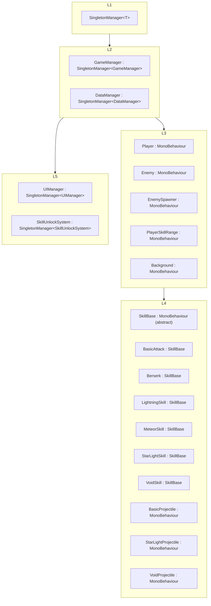
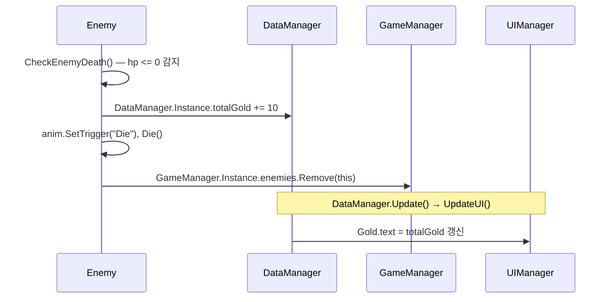
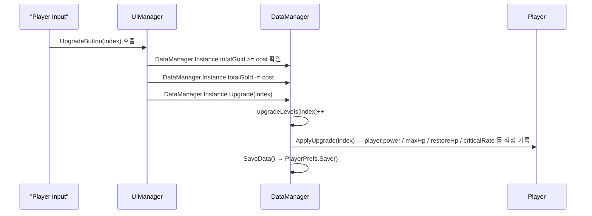
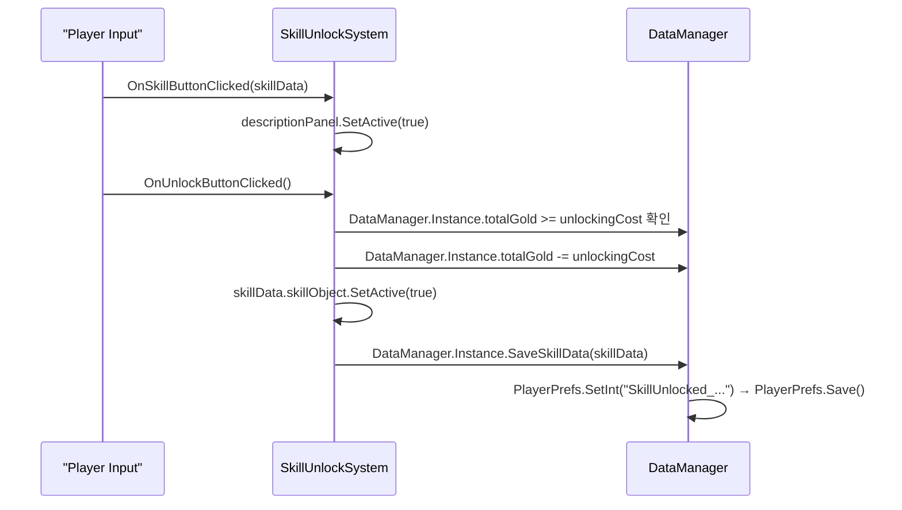
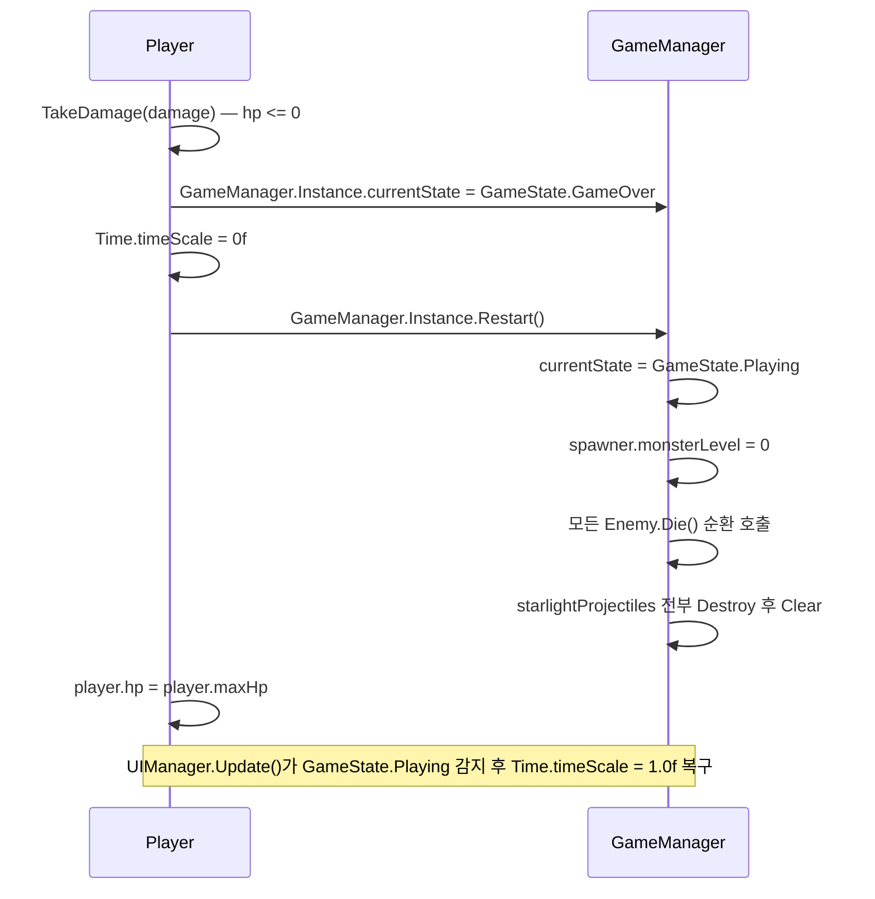
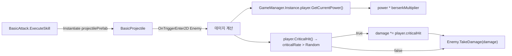
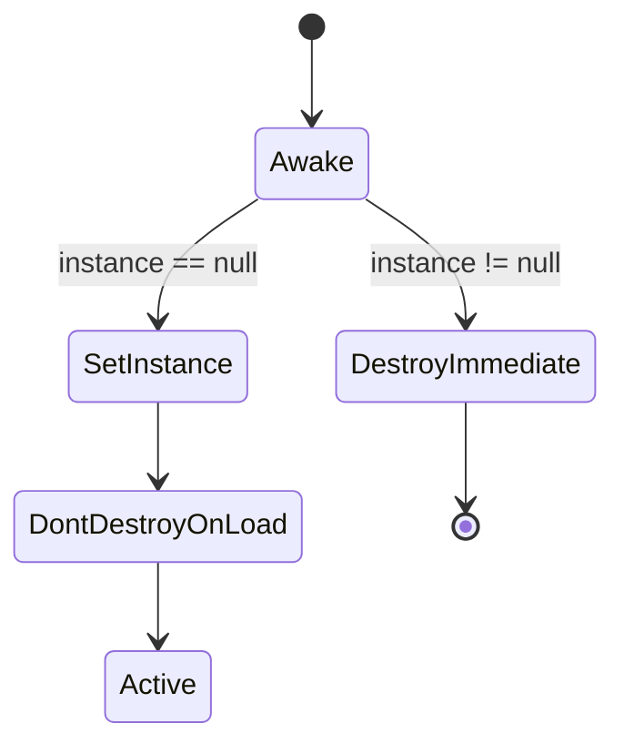

# Architecture Overview

> 프로젝트: Rock Spirit Idle  
> 문서 기준일: 2026-04-19  
> 스크립트 루트: `Rock Spirit Idle/Assets/Scripts/`

---

## System Map

도메인 간 의존성 — 실제 코드 내 `GameManager.Instance`, `DataManager.Instance`, `SkillUnlockSystem.Instance`, `UIManager.Instance` 참조를 기준으로 추출.

```mermaid
flowchart TD
    subgraph Singleton["Singleton Layer (DontDestroyOnLoad)"]
        GM["GameManager"]
        DM["DataManager"]
        SUS["SkillUnlockSystem"]
        UI["UIManager"]
    end

    subgraph Character["Character Domain"]
        PL["Player"]
        EN["Enemy"]
        ES["EnemySpawner"]
        PSR["PlayerSkillRange"]
    end

    subgraph Skills["Skills Domain"]
        SB["SkillBase (abstract)"]
        BA["BasicAttack"]
        BP["BasicProjectile"]
        BE["Berserk"]
        LS["LightningSkill"]
        MS["MeteorSkill"]
        SS["StarLightSkill"]
        SP["StarLightProjectile"]
        VS["VoidSkill"]
        VP["VoidProjectile"]
    end

    subgraph Scene["Scene Objects"]
        BG["Background"]
    end

    PL -->|"Awake: GameManager.Instance.player = this"| GM
    EN -->|"Start: GameManager.Instance.enemies.Add"| GM
    EN -->|"CheckEnemyDeath: DataManager.Instance.totalGold += 10"| DM
    ES -->|"Awake: GameManager.Instance.spawner = this"| GM
    PSR -->|"Start: GameManager.Instance.range = this"| GM

    BA -->|"ExecuteSkill: GameManager.Instance.range, player"| GM
    BP -->|"OnTriggerEnter2D: GameManager.Instance.player"| GM
    BE -->|"ExecuteSkill: GameManager.Instance.player.berserkMultiplier"| GM
    LS -->|"ExecuteSkill: GameManager.Instance.enemies, player"| GM
    MS -->|"Explode: GameManager.Instance.player"| GM
    SS -->|"ExecuteSkill: GameManager.Instance.starlightProjectiles"| GM
    SP -->|"OnTriggerEnter2D: GameManager.Instance.player, RemoveProjectile"| GM
    VS -->|"ExecuteSkill: player.transform.position"| GM
    VP -->|"OnTriggerStay2D: GameManager.Instance.player"| GM

    UI -->|"Update: GameManager.Instance.player, currentState"| GM
    UI -->|"UpgradeButton: DataManager.Instance.totalGold, Upgrade"| DM
    SUS -->|"Start: DataManager.Instance.LoadSkillData"| DM
    SUS -->|"OnUnlockButtonClicked: DataManager.Instance.totalGold, SaveSkillData"| DM

    DM -->|"Start: GameManager.Instance.player"| GM

    BG -->|"Update: player.anim"| PL

    SB -->|"Update/FindClosestEnemy: GameManager.Instance.enemies, range"| GM
    BA -.->|"extends"| SB
    BE -.->|"extends"| SB
    LS -.->|"extends"| SB
    MS -.->|"extends"| SB
    SS -.->|"extends"| SB
    VS -.->|"extends"| SB
```

---

## Layer Structure

**레이어 설명:**

- **Layer 1 — Singleton Infrastructure**: `SingletonManager<T>`가 `DontDestroyOnLoad` 패턴을 구현. 파생 클래스가 `base.Awake()`를 호출해 단일 인스턴스를 보장.
- **Layer 2 — Game State & Data**: `GameManager`는 런타임 상태(`enemies`, `starlightProjectiles`, `spawner`, `player`, `range`, `currentState`)를 보관. `DataManager`는 골드·업그레이드 레벨을 `PlayerPrefs`로 영속화.
- **Layer 3 — Character & Scene**: `Player`, `Enemy`, `EnemySpawner`, `PlayerSkillRange`, `Background`가 `GameManager`에 자신을 등록하거나 참조를 읽어 동작.
- **Layer 4 — Skills & Projectiles**: `SkillBase`를 상속한 스킬 6종과 독립 투사체 3종. 모든 투사체는 `GameManager.Instance.player`로 데미지 수치를 조회.
- **Layer 5 — UI & Presentation**: `UIManager`가 타이틀 화면·배속·종료 UI를 제어. `SkillUnlockSystem`이 스킬 잠금 해제 UI와 비용 차감을 처리.

---

## Data Flow

### 1. 적 사망 → 골드 적립

### 2. 업그레이드 구매 → 플레이어 스탯 변경

### 3. 스킬 잠금 해제 → 스킬 오브젝트 활성화

### 4. 플레이어 사망 → 재시작

### 5. 기본 공격 투사체 데미지 계산

---

## Domain Summary

> 각 도메인의 세부 문서: `Docs/Character/`, `Docs/Skills/`, `Docs/Systems/`, `Docs/Background/`

| Domain | Entry Point | Core Responsibility |
|--------|-------------|---------------------|
| Singleton Infrastructure | `SingletonManager<T>` | `DontDestroyOnLoad` 단일 인스턴스 보장; 파생 클래스 `Awake`에서 `base.Awake()` 호출 |
| Game State | `GameManager` | 런타임 전역 상태 보관: `enemies` 목록, `player` 참조, `spawner` 참조, `range` 참조, `starlightProjectiles`, `currentState(GameState)` |
| Data & Persistence | `DataManager` | 골드(`totalGold`), 업그레이드 레벨(`upgradeLevels`) 관리; `PlayerPrefs`를 통한 저장·불러오기; 업그레이드 적용(`ApplyUpgrade`) |
| Character | `Player`, `Enemy`, `EnemySpawner`, `PlayerSkillRange` | 플레이어 스탯·이동·피격; 적 이동·공격·사망; 스폰 주기 및 레벨 증가; 스킬 사용 범위 감지 |
| Skills | `SkillBase`, `BasicAttack`, `Berserk`, `LightningSkill`, `MeteorSkill`, `StarLightSkill`, `VoidSkill` | 쿨다운 관리(`CooldownRoutine`), 가장 가까운 적 탐색(`FindClosestEnemy`), 각 스킬 실행 로직(`ExecuteSkill`) |
| Projectiles | `BasicProjectile`, `StarLightProjectile`, `VoidProjectile` | 투사체 이동·충돌·데미지 적용; `GameManager.Instance.player`로 데미지 수치 조회 |
| UI & Skill Unlock | `UIManager`, `SkillUnlockSystem` | 타이틀·배속·종료 UI 제어; 스킬 잠금 해제 UI 및 골드 차감·저장 |
| Background | `Background` | `Player.anim.GetBool("isMoving")` 상태에 따라 텍스처 오프셋 스크롤 제어 |

---

## Singleton Instances

모두 `SingletonManager<T> : MonoBehaviour` 를 상속하며, 씬 전환 후에도 `DontDestroyOnLoad`로 유지된다.

| 클래스 | 인스턴스 접근 | 보관 상태 | 소비자 |
|--------|--------------|-----------|--------|
| `GameManager` | `GameManager.Instance` | `enemies(List<Enemy>)`, `starlightProjectiles(List<GameObject>)`, `spawner`, `player`, `range`, `currentState` | `Player`, `Enemy`, `EnemySpawner`, `PlayerSkillRange`, 모든 Skill, 모든 Projectile, `UIManager`, `DataManager` |
| `DataManager` | `DataManager.Instance` | `totalGold`, `upgradeLevels(List<int>)`, 업그레이드 UI 텍스트 참조 | `Enemy`(골드 적립), `UIManager`(업그레이드 구매), `SkillUnlockSystem`(스킬 저장·불러오기) |
| `SkillUnlockSystem` | `SkillUnlockSystem.Instance` | `skills(SkillData[])`, `currentSkillData`, UI 버튼·패널 참조 | 없음 (소비자 없이 UI 이벤트로만 구동) |
| `UIManager` | `UIManager.Instance` | `isGameStarted`, `m_IsButtonDowning`, UI 버튼·이미지 참조 | 없음 (버튼 콜백으로만 구동) |

### SingletonManager\<T\> 동작 규칙

- `instance == null`이면 자신을 `instance`로 등록하고 `DontDestroyOnLoad` 적용.  
- 이미 인스턴스가 존재하면 `DestroyImmediate(gameObject)`로 중복 오브젝트를 즉시 제거.
