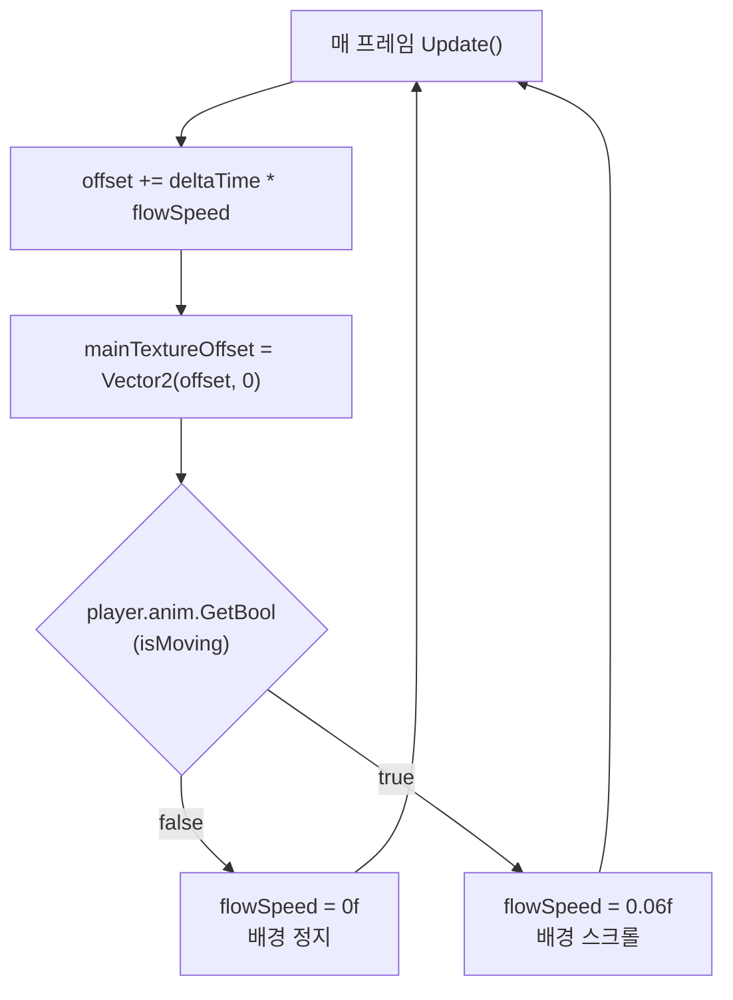
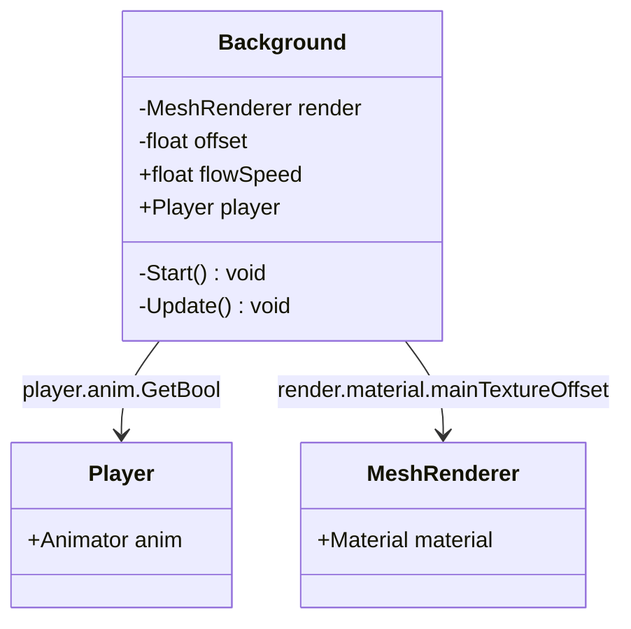

# Background

**파일 위치**: `Rock Spirit Idle/Assets/Scripts/Background.cs`

---

## 개요

`Background`는 `MonoBehaviour`를 상속하는 클래스로, `MeshRenderer.material.mainTextureOffset`을 프레임마다 증가시켜 배경 스크롤 애니메이션을 구현한다.  
`Player`의 애니메이터 파라미터 `isMoving`을 폴링하여 플레이어가 정지 상태일 때 스크롤을 멈춘다.

---

## 필드 목록

| 필드 | 타입 | 기본값 | 설명 |
|---|---|---|---|
| `render` | `MeshRenderer` | (Start에서 취득) | 배경 메시의 렌더러 |
| `offset` | `float` | `0` | 누적 텍스처 오프셋 값 |
| `flowSpeed` | `float` | `0.06f` | 텍스처 스크롤 속도 |
| `player` | `Player` | Inspector 할당 | 이동 상태 참조 대상 |

---

## Start()

```csharp
private void Start()
{
    render = GetComponent<MeshRenderer>();
}
```

`MeshRenderer` 컴포넌트를 취득한다.

---

## Update() — 스크롤 애니메이션 로직

```csharp
void Update()
{
    offset += Time.deltaTime * flowSpeed;
    render.material.mainTextureOffset = new Vector2(offset, 0);
    if (player.anim.GetBool("isMoving") == false)
        flowSpeed = 0f;
    else 
        flowSpeed = 0.06f;
}
```

처리 순서:
1. `offset += Time.deltaTime * flowSpeed` — 현재 `flowSpeed`로 이번 프레임의 오프셋 증분을 계산한다.
2. `render.material.mainTextureOffset = new Vector2(offset, 0)` — X축 방향으로 오프셋을 적용하여 배경이 옆으로 흐르는 효과를 만든다.
3. `player.anim.GetBool("isMoving")` 확인:
   - `false`이면 `flowSpeed = 0f` — 오프셋 증가가 멈춰 배경이 정지한다.
   - `true`이면 `flowSpeed = 0.06f` — 배경이 다시 스크롤된다.

`flowSpeed`는 `0.06f` 고정값과 `0f` 두 가지 상태만 사용한다.

---

## Player 이동 상태 동기화

`player.anim.GetBool("isMoving")`은 `Player` 컴포넌트가 보유한 `Animator`의 `isMoving` 파라미터를 직접 폴링한다.  
`Background`는 `Player`를 Inspector에서 참조하며, `GameManager.Instance`를 경유하지 않는다.



---

## 의존 관계


