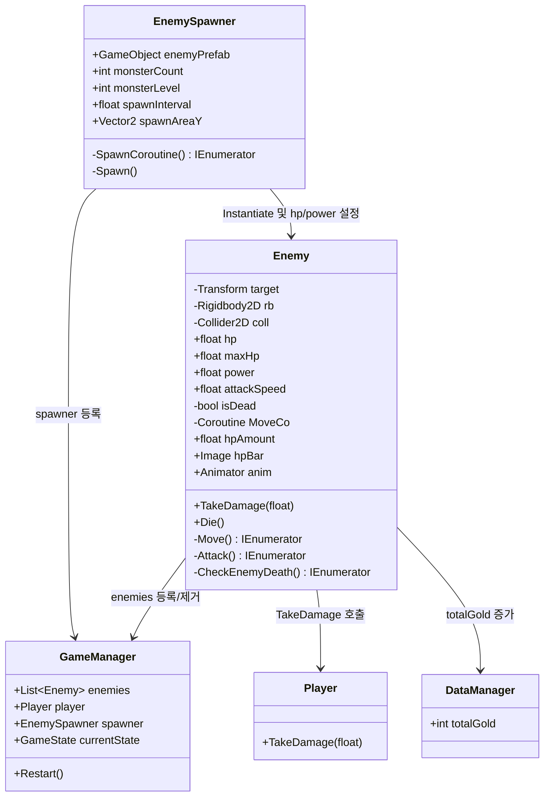
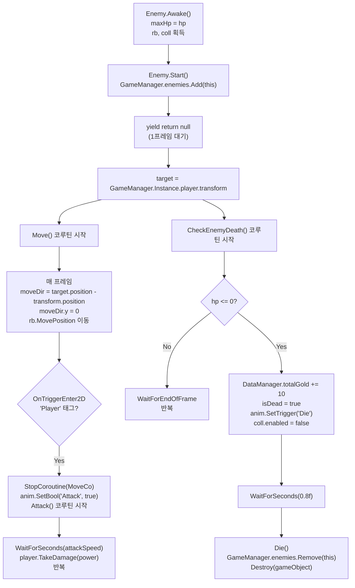

# Enemy

## Overview

`Enemy`는 플레이어를 향해 이동하다가 충돌 시 공격 코루틴으로 전환하며, HP가 0이 되면 골드를 지급하고 씬에서 제거되는 적 캐릭터 단위 클래스다.

## Architecture



## Core API

| Method | Signature | Role |
|---|---|---|
| `TakeDamage` | `public void TakeDamage(float damage)` | `hp -= damage` 수행 (사망 판정은 `CheckEnemyDeath` 코루틴에서 처리) |
| `Die` | `public void Die()` | `GameManager.Instance.enemies`에서 자신을 제거하고 `Destroy(gameObject)` 호출 |

## Internal Flow



## Data Structures

| 필드 | 타입 | 설명 |
|---|---|---|
| `hp` | `float` | 현재 HP (기본값 1) |
| `maxHp` | `float` | 최대 HP (`Awake`에서 초기 `hp` 값으로 설정) |
| `power` | `float` | 공격력 (기본값 1) |
| `attackSpeed` | `float` | 공격 간격 (초 단위, 기본값 0.7) |
| `isDead` | `bool` | 사망 상태 플래그 — `true`이면 `Update`의 HP 바 갱신 스킵 |
| `MoveCo` | `Coroutine` | `Move()` 코루틴 참조 — 플레이어 충돌 시 `StopCoroutine`으로 중단 |
| `hpAmount` | `float` (프로퍼티) | `hp / maxHp` — HP 바 `fillAmount`에 직접 바인딩 |

## Integration Points

- `Start()` 코루틴 첫 줄에서 `GameManager.Instance.enemies.Add(this)`로 등록
- `Start()` 코루틴에서 `yield return null` 1프레임 대기 후 `GameManager.Instance.player.transform`을 `target`으로 획득
- `CheckEnemyDeath()`에서 `DataManager.Instance.totalGold += 10`으로 골드 증가
- `Attack()` 코루틴에서 `GameManager.Instance.player.TakeDamage(power)` 호출
- `Die()`에서 `GameManager.Instance.enemies.Remove(this)` 후 `Destroy(gameObject)`

## EnemySpawner

`EnemySpawner`는 `GameManager.Instance.enemies.Count == 0` 조건이 충족될 때 `spawnInterval`초 대기 후 `Spawn()`을 호출한다.

**스폰 위치 계산**

```csharp
float spawnPointX = Camera.main.ViewportToWorldPoint(new Vector3(1.1f, 0, 0)).x + 0.5f;
for (int i = 0; i < monsterCount; i++)
{
    Vector3 spawnPosition = new Vector3(spawnPointX,
                                        Random.Range(spawnAreaY.x, spawnAreaY.y),
                                        0);
    mon = Instantiate(enemyPrefab, spawnPosition, Quaternion.identity);
    mon.GetComponent<Enemy>().hp = 1 + (monsterLevel * 0.1f);
    mon.GetComponent<Enemy>().power = 1 + (monsterLevel * 1f);
    spawnPointX += 0.5f;
}
monsterLevel++;
```

- **x 위치**: 뷰포트 좌표 (1.1, 0)을 월드 좌표로 변환한 값에 0.5f를 더해 화면 오른쪽 밖에서 시작하며, 적마다 0.5f씩 추가 오프셋을 부여해 일렬로 배치
- **y 위치**: `spawnAreaY` 범위 내 랜덤 (`spawnAreaY = new Vector2(0.4f, 0.7f)` 기본값)
- **몬스터 레벨 스케일링 공식**:
  - `hp = 1 + (monsterLevel × 0.1)`
  - `power = 1 + (monsterLevel × 1.0)`
  - 스폰 완료 후 `monsterLevel++`

## Core Logic Snippet

**`Move` 코루틴 — 플레이어 추적 이동**

```csharp
private IEnumerator Move()
{
    while (true)
    {
        yield return null;
        Vector2 moveDir = target?.position - transform.position ?? Vector2.zero;
        moveDir.y = 0;
        moveDir = moveDir.normalized;
        if (moveDir.magnitude > 0.0000f)
        {
            Vector2 movePos = rb.position + (moveDir * Time.fixedDeltaTime);
            rb.MovePosition(movePos);
        }
    }
}
```

**`Attack` 코루틴 — 플레이어 공격**

```csharp
private IEnumerator Attack()
{
    while(true)
    {
        yield return new WaitForSeconds(attackSpeed);
        GameManager.Instance.player.TakeDamage(power);
    }
}
```

**`CheckEnemyDeath` 코루틴 — 사망 판정 및 골드 지급**

```csharp
private IEnumerator CheckEnemyDeath()
{
    while (true)
    {
        if (hp <= 0)
        {
            DataManager.Instance.totalGold += 10;
            isDead = true;
            anim.SetTrigger("Die");
            coll.enabled = false;
            yield return new WaitForSeconds(0.8f);
            Die();
        }
        yield return new WaitForEndOfFrame();
    }
}
```

**`SpawnCoroutine` — 웨이브 트리거 조건**

```csharp
private IEnumerator SpawnCoroutine()
{
    while (true)
    {
        if (GameManager.Instance.enemies.Count == 0)
        {
            yield return new WaitForSeconds(spawnInterval);
            Spawn();
        }
        yield return null;
    }
}
```
