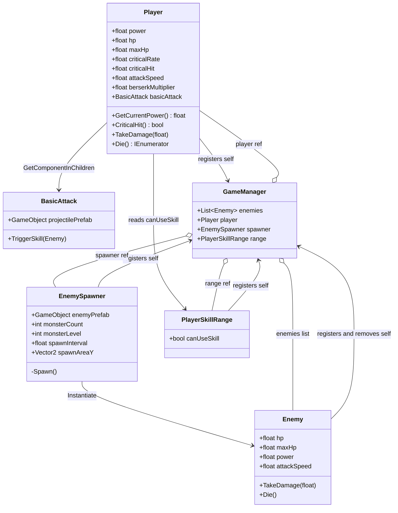
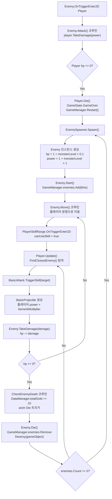

# Character

## Purpose

Character 도메인은 플레이어(`Player`)와 적(`Enemy`)의 스탯, 이동, 공격, 사망 처리를 담당하며, `EnemySpawner`를 통해 웨이브 단위로 적을 생성하고 `PlayerSkillRange`를 통해 플레이어의 공격 가능 여부를 판정한다.

## Architecture

## Key Components

| Class | File | Role |
|---|---|---|
| `Player` | `Rock Spirit Idle/Assets/Scripts/Character/Player.cs` | 플레이어 스탯 보유, 매 Update에서 가장 가까운 적 탐색 후 `BasicAttack` 호출, HP 회복 코루틴 실행, 사망 시 게임 재시작 처리 |
| `Enemy` | `Rock Spirit Idle/Assets/Scripts/Character/Enemy.cs` | 적 스탯 보유, 플레이어 방향으로 이동, 플레이어 충돌 시 공격 코루틴 시작, 사망 시 골드 지급 후 자기 자신 제거 |
| `EnemySpawner` | `Rock Spirit Idle/Assets/Scripts/Character/EnemySpawner.cs` | 적 리스트가 빌 때마다 웨이브를 스폰하고 `monsterLevel`에 따라 HP/공격력을 스케일링 |
| `PlayerSkillRange` | `Rock Spirit Idle/Assets/Scripts/Character/PlayerSkillRange.cs` | 2D 트리거 영역 안에 적이 있는지 감지하여 `canUseSkill` 플래그 제공 |

## Dependencies

- **Depends on:**
  - `GameManager` (`Rock Spirit Idle/Assets/Scripts/Systems/GameManager.cs`) — `enemies`, `player`, `spawner`, `range`, `currentState`, `Restart()` 접근
  - `DataManager` — `Enemy.CheckEnemyDeath`에서 `DataManager.Instance.totalGold` 증가
  - `BasicAttack` (`Rock Spirit Idle/Assets/Scripts/Skills/BasicAttack.cs`) — `Player`가 `GetComponentInChildren`으로 획득하여 `TriggerSkill` 호출
  - `SingletonManager<T>` — `GameManager`의 기반 클래스

- **Depended by:**
  - `Skills` 도메인 — `BasicAttack`, `SkillBase` 등이 `Player`, `Enemy`, `GameManager.Instance.player/range`를 참조
  - `UI` 도메인 — HP 바(`Image hpBar`, `Text curHp`)를 Player/Enemy가 직접 보유

## Data Flow

---

## 세부 문서

| 문서 | 대상 클래스 |
|------|------------|
| `Docs/Character/Player.md` | `Player` |
| `Docs/Character/Enemy.md` | `Enemy`, `EnemySpawner` |
