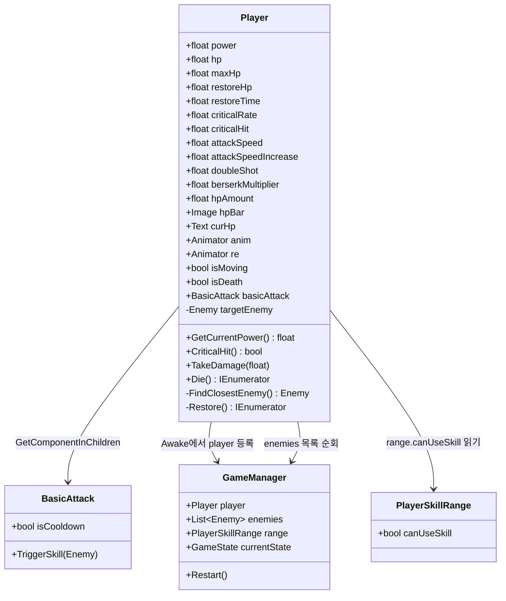
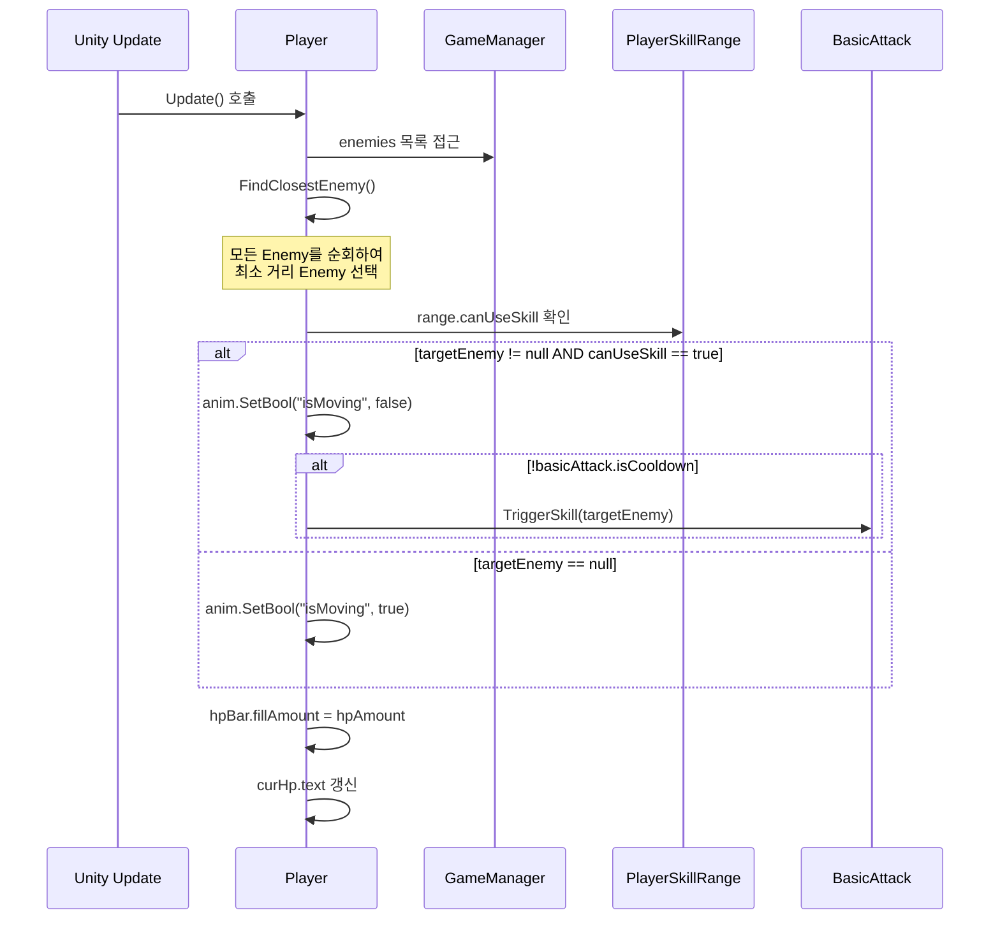

# Player

## Overview

`Player`는 플레이어 캐릭터의 스탯과 생존 상태를 관리하고, 매 프레임 가장 가까운 적을 탐색하여 `BasicAttack`을 통해 공격을 수행한다.

## Architecture



## Core API

| Method | Signature | Role |
|---|---|---|
| `GetCurrentPower` | `public float GetCurrentPower()` | `power × berserkMultiplier`를 반환하여 버서크 상태 배율을 반영한 실제 공격력을 제공 |
| `CriticalHit` | `public bool CriticalHit()` | `criticalRate`와 0~100 사이 난수를 비교하여 치명타 여부를 반환 |
| `TakeDamage` | `public void TakeDamage(float damage)` | `hp -= damage` 후 hp가 0 이하이면 `Die()` 코루틴을 시작 |
| `Die` | `public IEnumerator Die()` | `GameState.GameOver` 설정, `Time.timeScale = 0`, 재시작 처리 후 부활 연출 |

## Internal Flow



## Data Structures (핵심 필드)

| 필드 | 타입 | 설명 |
|---|---|---|
| `power` | `float` | 기본 공격력 |
| `hp` | `float` | 현재 HP |
| `maxHp` | `float` | 최대 HP (`Awake`에서 초기 `hp` 값으로 설정) |
| `restoreHp` | `float` | 매 `restoreTime`초마다 회복하는 HP 양 |
| `restoreTime` | `float` | HP 회복 주기 (초 단위, 기본값 5) |
| `criticalRate` | `float` | 치명타 확률 (0~100 범위) |
| `criticalHit` | `float` | 치명타 피해 배율 (기본값 1) |
| `attackSpeed` | `float` | 공격 속도 기준값 (기본값 1) |
| `attackSpeedIncrease` | `float` | 공격 속도 증가량 (합산 후 `BasicAttack`이 사용) |
| `doubleShot` | `float` | 이중 투사체 발사 확률 (0~100 범위) |
| `berserkMultiplier` | `float` | 버서크 상태 공격력 배율 (기본값 1) |
| `hpAmount` | `float` (프로퍼티) | `hp / maxHp` — HP 바 `fillAmount`에 직접 바인딩 |

## Integration Points

- `Awake()`에서 `GameManager.Instance.player = this`로 자신을 전역 참조에 등록
- `Start()`에서 `GetComponentInChildren<BasicAttack>()`으로 자식 오브젝트의 `BasicAttack` 컴포넌트를 획득
- `Update()`에서 `GameManager.Instance.range` (`PlayerSkillRange`)의 `canUseSkill` 플래그를 읽어 공격 가능 여부 결정
- `Update()`에서 `GameManager.Instance.enemies` 목록을 순회하여 `FindClosestEnemy()` 수행
- `Die()` 코루틴에서 `GameManager.Instance.Restart()` 호출 및 `GameManager.Instance.player.hp` 초기화

## Core Logic Snippet

**`FindClosestEnemy` — 최소 거리 탐색**

```csharp
private Enemy FindClosestEnemy()
{
    Enemy closestEnemy = null;
    float closestDistance = float.MaxValue;

    foreach (Enemy enemy in GameManager.Instance.enemies)
    {
        float distance =
            Vector3.Distance(transform.position, enemy.transform.position);
        if (distance < closestDistance)
        {
            closestDistance = distance;
            closestEnemy = enemy;
        }
    }

    return closestEnemy;
}
```

**`GetCurrentPower` — 버서크 배율 반영**

```csharp
public float GetCurrentPower()
{
    return power * berserkMultiplier;
}
```

**`CriticalHit` — 치명타 판정**

```csharp
public bool CriticalHit()
{
    return criticalRate > Random.Range(0, 100);
}
```

**`Restore` — 주기적 HP 회복 코루틴**

```csharp
private IEnumerator Restore()
{
    while (true)
    {
        yield return new WaitForSeconds(restoreTime);
        hp += restoreHp;
        if (hp > maxHp)
        {
            hp = maxHp;
        }
    }
}
```

**`Die` — 사망 및 재시작 처리**

```csharp
public IEnumerator Die()
{
    GameManager.Instance.currentState = GameState.GameOver;
    Time.timeScale = 0f;
    yield return new WaitForSecondsRealtime(0.1f);

    GameManager.Instance.Restart();
    GameManager.Instance.player.hp = GameManager.Instance.player.maxHp;

    re.gameObject.SetActive(true);
    yield return new WaitForSeconds(1.5f);
    re.gameObject.SetActive(false);
}
```
