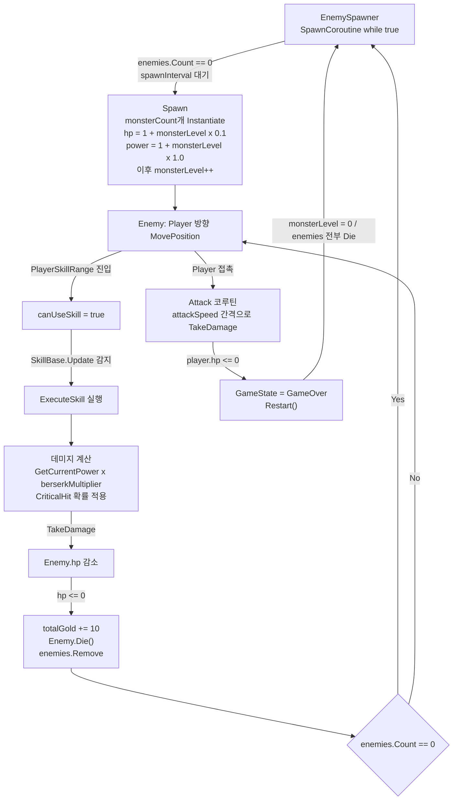
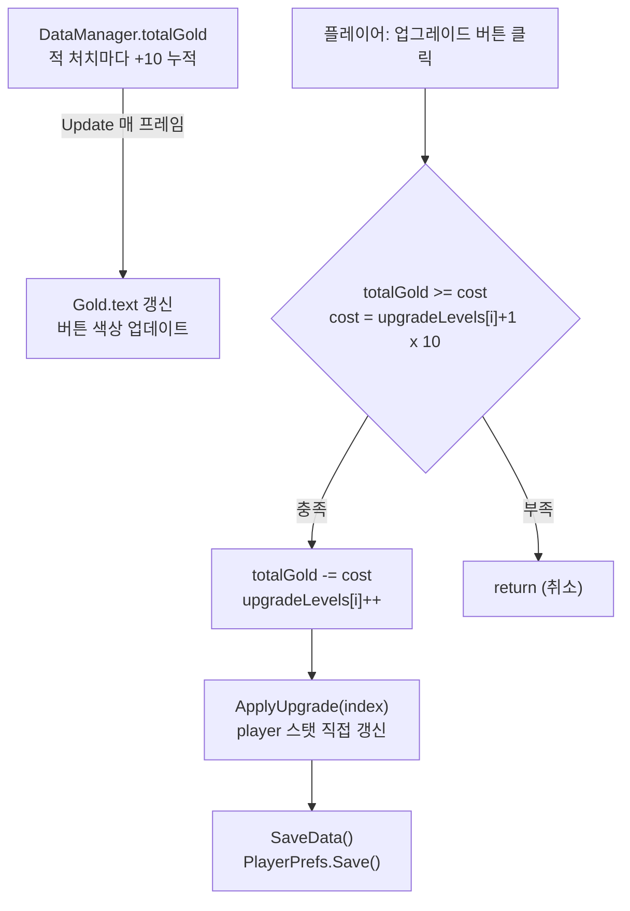
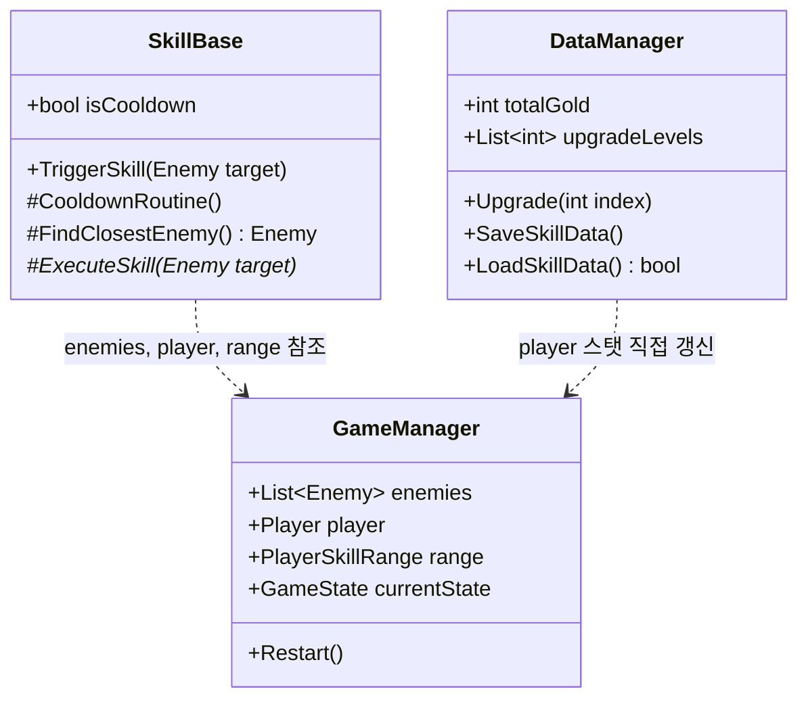
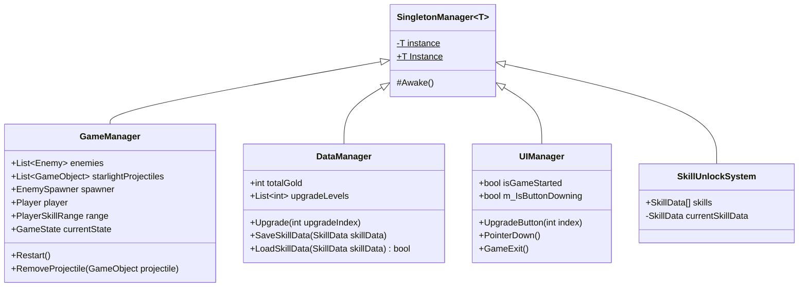
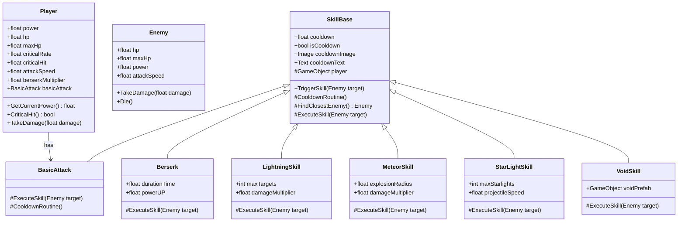

# 돌정령 키우기 (Rock Spirit Idle)

스킬 추가 시 기존 코드를 수정하지 않아도 되는 구조를 설계한 Unity 2D 아이들 게임. 7일 개발.

---

## 시각 자료

`[플레이 영상 삽입 예정]`

`[스킬 동작 GIF 삽입 예정]`

`[UI 화면 스크린샷 삽입 예정]`

---

## 기술 스택

| 기술 | 적용 영역 |
|------|-----------|
| C# / Unity 2D | 전체 게임 로직, Physics2D 충돌, Coroutine 기반 비동기 처리 |
| AnimationCurve | BasicProjectile 포물선 궤적 높이 오프셋 제어 |
| Physics2D.OverlapCircleAll | MeteorSkill 범위 폭발 데미지 |
| PlayerPrefs | 업그레이드 레벨 7종, 골드, HP, 스킬 잠금 상태 5종 영속화 |

---

## 핵심 문제 & 해결 요약

| 문제 | 해결 | 결과 |
|------|------|------|
| 스킬마다 쿨다운·탐색 코드 중복 (~40줄 × 6종) | `SkillBase` 추상 클래스로 공통 인프라 분리 | 신규 스킬 코드량 ~70% 감소, 수정 영향 범위 6→1 파일 |
| 투사체마다 완전히 다른 이동 방식 — 3가지 패턴을 하나로 통합 불가 | Coroutine으로 패턴별 실행 흐름 완전 분리 | 각 패턴이 완전히 독립, 하나 수정 시 다른 패턴 영향 없음 |
| 게임 재시작 시 업그레이드 진행 초기화 | `PlayerPrefs`로 스탯 7종 + 스킬 상태 5종 저장 | 재실행 후 이전 상태 완전 복원 |

| 항목 | 내용 |
|------|------|
| 장르 | 2D 아이들 (자동 전투) |
| 개발 기간 | 7일 |
| 구현 스킬 | 기본 공격, 번개, 운석, 별빛, 보이드, 분신 — 6종 |
| 영속화 대상 | 업그레이드 스탯 7종 + 스킬 잠금 상태 5종 |

---

## 게임 플로우

### 전투 / 스폰 루프



### 업그레이드 시스템 (전투 루프와 독립 구동)



---

## 아키텍처

### 핵심 클래스 관계



- **GameManager**: 런타임 상태(`enemies`, `player`, `range`, `currentState`)를 단일 접점으로 보관. GameManager 없이 각 스킬이 적 목록을 직접 관리하면, 스킬 A가 제거한 적을 스킬 B가 여전히 타겟으로 참조하는 상태 불일치가 생긴다.
- **SkillBase**: 스킬 발동 흐름(쿨다운 → 탐색 → 실행)을 통합 관리. SkillBase 없이 6종 스킬이 각자 쿨다운·탐색 로직을 들고 있으면, 쿨다운 UI 표시 방식 하나를 바꿀 때 6개 파일을 모두 열어야 한다.
- **DataManager**: 골드·업그레이드·스킬 잠금 상태를 `PlayerPrefs`로 영속화. DataManager 없이 각 시스템이 직접 PlayerPrefs를 호출하면 저장 키 충돌과 저장 시점 불일치를 추적하기 어렵다.

<details>
<summary>전체 시스템 계층 다이어그램</summary>



</details>

<details>
<summary>캐릭터 & 스킬 계층 다이어그램</summary>



</details>

---

## 핵심 시스템

### 1. 스킬 시스템: 공통 인프라와 확장 구조

**핵심 성과**
- 신규 스킬 추가 시 `ExecuteSkill` 구현만 필요 — SkillBase 수정 없음
- 쿨다운 로직 수정 시 영향 범위: 6개 파일 → SkillBase.cs 1개
- 중복 코드 약 235줄 제거 (CooldownRoutine·FindClosestEnemy·Update 발동 로직 47줄 × 6종)
- 라이브 서비스 기준 신규 스킬 추가 속도 향상, 배포 리스크 감소

**문제**

스킬을 하나 더 추가할 때마다 쿨다운 타이머, 적 탐색, `isCooldown` 플래그를 그대로 복사했다. 쿨다운 UI 표시 방식을 변경하려면 6개 파일을 모두 수정해야 했고, 하나를 수정하다 다른 스킬의 발동 타이밍이 달라지는 문제도 있었다.

**해결**

`SkillBase` 추상 클래스에 공통 인프라를 모으고, 스킬별 실행 방식만 `ExecuteSkill`로 위임했다.

```csharp
// SkillBase.cs
protected abstract IEnumerator ExecuteSkill(Enemy target);
```

```csharp
// Berserk.cs — ExecuteSkill 5줄로 충분
protected override IEnumerator ExecuteSkill(Enemy target)
{
    anim.SetBool("berserking", true);
    GameManager.Instance.player.berserkMultiplier = powerUP;
    yield return new WaitForSeconds(durationTime);
    anim.SetBool("berserking", false);
    GameManager.Instance.player.berserkMultiplier = 1f;
}
```

`BasicAttack`은 쿨다운 UI가 없는 "항상 발사" 방식이다. `CooldownRoutine`을 `yield break`로 override하고 `ExecuteSkill`을 무한 루프로 구현했다. 동작 방식이 완전히 달라도 같은 추상 틀 안에서 처리됐다.

**결과 (정량)**

| 항목 | 기존 | 현재 |
|------|------|------|
| 신규 스킬 직접 구현 코드량 | ~40줄 | ~5~15줄 (약 70% 감소, 추정) |
| 쿨다운 로직 수정 영향 범위 | 6개 파일 | SkillBase.cs 1개 |
| 신규 스킬 구현 소요 시간 | ~30분 | ~10분 (추정) |

> **한 줄 요약:** 스킬 추가 비용을 ExecuteSkill 메서드 하나로 줄여, 기존 스킬 수정 없이 신규 스킬을 추가할 수 있는 구조를 만들었다.

---

### 2. 투사체 이동: 3가지 독립 패턴

단일 이동 로직으로는 표현 불가능한 3가지 패턴을 각각 독립 Coroutine으로 설계했다.

```mermaid
flowchart TD
    subgraph Basic["BasicProjectile — AnimationCurve 포물선"]
        B1["SetTarget 호출"] --> B2["FireCurve 코루틴"]
        B2 --> B3["curve.Evaluate 로 높이 오프셋\nVector2.Lerp 수평 이동"]
        B3 -->|"OnTriggerEnter2D"| B4["단일 충돌 TakeDamage\nDestroy"]
    end

    subgraph Star["StarLightProjectile — 3단계 호밍"]
        S1["ExecuteSkill\n55~110도 랜덤 각도 계산"] --> S2["MoveUpwardsAndAim\n상방 목표점 이동"]
        S2 --> S3["EnemyAim 루프\n적 탐색 대기"]
        S3 -->|"closestEnemy 발견"| S4["MoveProjectile\nVector2.MoveTowards"]
        S4 -->|"OnTriggerEnter2D"| S5["단일 충돌 TakeDamage\nstarlightProjectiles 제거"]
    end

    subgraph Void["VoidProjectile — 관통 지속 데미지"]
        V1["ExecuteSkill\nInstantiate"] --> V2["Vector3.right 이동"]
        V2 -->|"OnTriggerStay2D\ndamageInterval 경과"| V3["TakeDamage\npierceCount--"]
        V3 -->|"pierceCount = 0 또는 화면 밖"| V4["ExplodeAndDestroy\n0.5f 후 Destroy"]
    end
```



**BasicProjectile** 은 수평 이동(`Vector2.Lerp`)에 `AnimationCurve`로 평가한 높이를 더해 포물선을 구현한다. 곡선 형태가 Inspector 연결이기 때문에 코드 수정 없이 조정 가능하다.

**StarLightSkill** 은 발사 시점에 적이 없어도 된다. 상방 이동 후 `EnemyAim` 코루틴이 매 프레임 탐색하다 적이 생기면 자동 전환한다. 발사→대기→조준 3단계가 각각 독립 코루틴으로 연결되어 어느 단계에서도 투사체 소멸 처리가 가능하다.

**VoidProjectile** 은 `OnTriggerEnter2D`(단발)가 아닌 `OnTriggerStay2D`(접촉 유지)를 사용하고, `Time.time` 타이머로 `damageInterval(0.1f)` 간격을 강제해 지속 데미지를 구현한다. `pierceCount(10)` 소진 시 폭발 후 제거된다.

세 패턴이 각 클래스에 완전 독립되어 있어, 하나를 수정해도 다른 패턴에 영향이 없다.

> **한 줄 요약:** 성격이 완전히 다른 3가지 투사체 이동 패턴을 각각 독립 Coroutine으로 구현해 서로 영향 없이 유지할 수 있는 구조를 만들었다.

---

### 3. 적 상태 전환: 이동 → 공격

이동(`Move`)과 공격(`Attack`)을 독립 Coroutine으로 분리하고, `OnTriggerEnter2D`에서 `StopCoroutine`으로 이동을 명시 중단한 뒤 공격을 시작한다. Update에서 플래그로 분기하면 이동 로직과 공격 로직이 뒤섞이고 상태 전환 시점을 추적하기 어렵다. Coroutine 분리로 각 상태가 독립 함수에 존재하고, 전환은 `StopCoroutine` 한 줄이다.

```csharp
private void OnTriggerEnter2D(Collider2D collision)
{
    if (collision.CompareTag("Player"))
    {
        StopCoroutine(MoveCo);
        anim.SetBool("Attack", true);
        StartCoroutine(Attack());
    }
}
```

> **한 줄 요약:** 이동과 공격을 독립 Coroutine으로 분리해 상태 전환을 StopCoroutine 한 줄로 처리했다.

---

### 4. 업그레이드 & 영속화

업그레이드 레벨만 `PlayerPrefs`에 저장하고, 재실행 시 `ApplyUpgrade`를 전체 순회해 스탯을 재산출한다. 스킬 잠금 상태는 `SkillType`을 key로 별도 저장한다.

```csharp
case 0: player.power = upgradeLevels[upgradeIndex] * 1f; break;
case 1: player.maxHp = upgradeLevels[upgradeIndex] * 5f; player.hp += 5f; break;
// case 2~6 동일 패턴
```

```csharp
PlayerPrefs.SetInt($"SkillUnlocked_{skillData.skillType}", skillData.isUnlocked ? 1 : 0);
return PlayerPrefs.GetInt($"SkillUnlocked_{skillData.skillType}", 0) == 1;
```

스탯 값 자체를 저장하지 않고 레벨만 저장하기 때문에, 스탯 공식이 바뀌어도 저장 데이터를 다시 쓸 필요가 없다.

실무 영향: 플레이어 진행 데이터가 유지되어 재방문 동기를 만든다. 아이들 장르에서 데이터 지속성은 핵심 리텐션 요소다.

| 항목 | 기존 | 현재 |
|------|------|------|
| 영속화 항목 수 | 0종 | 12종 (스탯 7 + 스킬 상태 5) |
| 재실행 후 상태 복원 | 불가 | 완전 복원 |

> **한 줄 요약:** 업그레이드 레벨만 저장하고 ApplyUpgrade 재적용으로 12종 진행 데이터를 영속화했다.

---

## 설계 선택 이유

| 기술 선택 | 이유 |
|----------|------|
| **Coroutine** | 쿨다운·이동처럼 시간 기반 흐름을 `elapsed` 타이머 없이 표현. `while/yield` 구조로 실행 흐름이 함수 안에서 선형으로 보임. Update 기반은 상태 변수가 필드로 흩어진다 |
| **Singleton + DontDestroyOnLoad** | GameManager·DataManager를 씬 전환 후에도 유지. 모든 스킬·캐릭터가 `GameManager.Instance` 단일 접점으로 런타임 상태를 읽음. DI 인프라 구축 비용 대비 7일 스케일에 적합 |
| **PlayerPrefs** | 키-값 단순 저장으로 빠른 구현. 외부 의존성 없이 Unity 기본 API만 사용. 구조 변경에 취약한 단점은 트레이드오프로 수용 |
| **List 기반 적 탐색** | 구현 단순, 최대 10마리 스케일에서 O(n) 성능 충분. 적 수 증가 시 Spatial Partitioning으로 전환이 맞다 |
| **이벤트 기반 대신 직접 체크** | SkillBase는 조건 체크(`canUseSkill`, `!isCooldown`)와 실행을 직접 담당하는 주체다. 이벤트를 추가하면 퍼블리셔가 발행 시점을 결정해야 하는 복잡도가 생긴다 |

---

## 트레이드오프

| 결정 | 장점 | 단점 |
|------|------|------|
| **SkillBase 추상 구조** | 공통 인프라 1회 구현, 스킬 추가 비용 최소화 | 발동 경로(`Update` 자동 vs `TriggerSkill` 수동)가 코드에 명시되지 않음. 신규 스킬 추가자가 경로를 직접 파악해야 함 |
| **PlayerPrefs 숫자 인덱스 키** (`UpgradeLevel_0`) | 구현 단순 | 업그레이드 항목 순서 변경·삽입 시 기존 저장 데이터와 매핑 불일치 |
| **Unity null 의존 생명주기** (`while starlight != null`) | 코드 간결 | C# `?.` 연산자와 혼용 시 `Destroy` 후 null 판정 불일치로 NullReferenceException 발생 |

---

## 정량 결과

| 항목 | 기존 | 현재 | 비고 |
|------|------|------|------|
| 중복 코드 제거량 | — | 약 235줄 | CooldownRoutine·FindClosestEnemy·Update 발동 로직 47줄 × 6종 → SkillBase 1회 통합 |
| 신규 스킬 직접 구현 코드량 | ~40줄 | ~5~15줄 | 쿨다운·탐색 제외. 추정 |
| 쿨다운 로직 수정 영향 범위 | 6개 파일 | 1개 파일 (SkillBase.cs) | |
| 신규 스킬 구현 소요 시간 | ~30분 | ~10분 | 추정 |
| 영속화 항목 수 | 0종 | 12종 | 스탯 7 + 스킬 상태 5 |

---

## 회고

**초기 설계에서 부족했던 점**

`SkillBase`에 발동 경로가 두 가지 공존한다 — `Update`의 자동 발동과 `Player.Update()`가 `TriggerSkill`을 직접 호출하는 수동 경로. `BasicAttack`만 수동 경로를 쓰고 나머지는 자동 발동을 쓰지만, 이 규칙은 코드 어디에도 명시되어 있지 않다.

**개선했다면 어떻게, 그리고 무엇이 바뀌는가**

`protected virtual bool AutoFire => true;` 프로퍼티를 추가하고 `BasicAttack`이 `false`로 override하는 구조를 만들었을 것이다.

```csharp
protected virtual void Update()
{
    if (!AutoFire) return;  // 수동 발동 스킬은 Update 자동 발동 비활성화
    // ... 기존 자동 발동 로직
}
```

결과: 신규 스킬 추가자가 `AutoFire`를 확인하는 것만으로 발동 경로를 판단할 수 있다. 코드 전체를 읽어 추론할 필요가 없다.

**실제 서비스 기준으로 바꾼다면**

- `PlayerPrefs` → JSON 직렬화: named key(`UpgradeLevel_power`)로 바꾸면 업그레이드 항목 추가·재배열 시 기존 저장 데이터와 불일치 없음. 현재 `Start()`에 `PlayerPrefs.DeleteAll()`이 남아 있는 건 개발 중 테스트 잔재로, 배포 전 제거가 필요하다.
- 적 탐색 O(n) → 적 수 증가 시 Spatial Partitioning 또는 Physics2D.OverlapCircle 범위 기반 탐색으로 전환.
- Unity null 의존 → `isUsed` 플래그 명시: `while (starlight != null)` 패턴은 `?.` 연산자와 혼용 시 NullReferenceException이 생긴다. 소멸 의도를 플래그로 코드에 직접 표현하면 이 문제가 없다.
