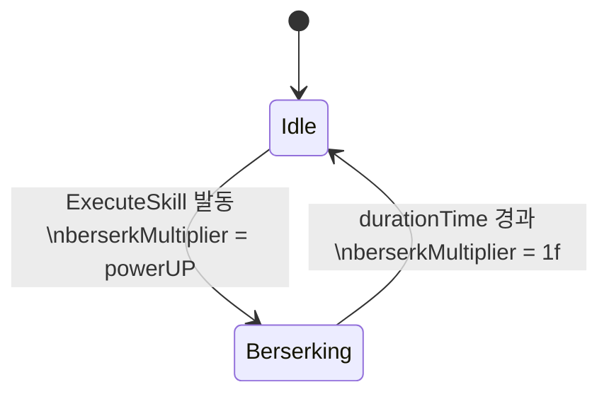

# Berserk

**파일**: `Rock Spirit Idle/Assets/Scripts/Skills/Berserk.cs`  
**타입**: `class Berserk : SkillBase`

---

## 개요

`Berserk`는 `durationTime` 동안 `GameManager.Instance.player.berserkMultiplier` 값을 `powerUP`으로 변경하여 플레이어의 공격력 배율을 높인다. 지속 시간이 끝나면 `berserkMultiplier`를 `1f`(기본값)로 복원한다.

---

## 필드

| 필드 | 타입 | 기본값 | 설명 |
|------|------|--------|------|
| `durationTime` | `float` | `10f` | 버서크 지속 시간(초) |
| `powerUP` | `float` | `2f` | 활성화 중 `berserkMultiplier`에 적용되는 값 |
| `anim` | `Animator` | Inspector 할당 | 버서크 애니메이션 상태 제어 |

---

## ExecuteSkill

```csharp
protected override IEnumerator ExecuteSkill(Enemy target)
{
    anim.SetBool("berserking", true);
    GameManager.Instance.player.berserkMultiplier = powerUP;

    yield return new WaitForSeconds(durationTime);

    anim.SetBool("berserking", false);
    GameManager.Instance.player.berserkMultiplier = 1f;
}
```

- 발동 시: `anim.SetBool("berserking", true)` → `berserkMultiplier = powerUP(2f)`
- `durationTime(10f)` 초 대기
- 종료 시: `anim.SetBool("berserking", false)` → `berserkMultiplier = 1f`

`berserkMultiplier`는 `Player.GetCurrentPower()` 내부에서 최종 공격력 계산에 곱해진다. 기본 동작 흐름은 `SkillBase.Update`가 제공하며, 쿨다운 UI는 `SkillBase.CooldownRoutine`을 그대로 사용한다.

---

## 상태 전이



---

## 의존 관계

| 의존 대상 | 접근 방법 |
|-----------|-----------|
| `GameManager.Instance.player.berserkMultiplier` | 직접 필드 쓰기 |
| `Animator` (`anim`) | `SetBool("berserking", bool)` |
| `SkillBase.CooldownRoutine` | 상속, 오버라이드 없음 |
