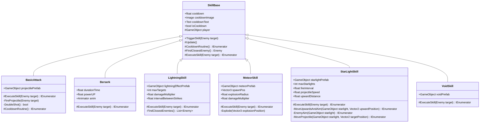

# Skills Domain — Overview

**작성일**: 2026-04-19  
**대상 프로젝트**: Rock Spirit Idle  
**소스 경로**: `Rock Spirit Idle/Assets/Scripts/Skills/`

---

## Purpose

Skills 도메인은 플레이어 캐릭터가 전투 중 사용하는 모든 공격 행동을 정의한다. 각 스킬은 `SkillBase`를 상속받아 쿨다운 관리, 가장 가까운 적 탐색, 데미지 계산을 공유 인터페이스로 처리하며, 구체적인 공격 동작은 `ExecuteSkill` 코루틴에서 각 서브클래스가 독립적으로 구현한다.

---

## Architecture



---

## Key Components

| 클래스 | 파일 | 역할 |
|--------|------|------|
| `SkillBase` | `Skills/SkillBase.cs` | 추상 기반 클래스. 쿨다운, 적 탐색, 자동 발동 루프 |
| `BasicAttack` | `Skills/BasicAttack.cs` | 무한 루프 기반 기본 투사체 발사 |
| `BasicProjectile` | `Skills/basicProjectile.cs` | BasicAttack 투사체. AnimationCurve 포물선 이동 |
| `Berserk` | `Skills/Berserk.cs` | `berserkMultiplier` 변경으로 일시적 공격력 배율 적용 |
| `LightningSkill` | `Skills/LightningSkill.cs` | 거리 정렬 후 최대 8개 대상에 순차 번개 타격 |
| `MeteorSkill` | `Skills/MeteorSkill.cs` | 대상 위치에 메테오 소환 후 범위 폭발 |
| `StarLightSkill` | `Skills/StarLightSkill.cs` | 위로 쏘아올린 투사체가 대기 후 가장 가까운 적을 추적 |
| `StarLightProjectile` | `Skills/StarLightProjectile.cs` | StarLightSkill 투사체. 단일 충돌 처리 후 폭발 애니메이션 |
| `VoidSkill` | `Skills/VoidSkill.cs` | 관통형 보이드 투사체 생성 |
| `VoidProjectile` | `Skills/VoidProjectile.cs` | 오른쪽으로 이동하며 `damageInterval` 주기로 반복 데미지 |

---

## Dependencies

| 의존 대상 | 사용 위치 | 접근 방법 |
|-----------|-----------|-----------|
| `GameManager.Instance.player` | 모든 스킬 — 공격력, 치명타, 버서크 배율 | Singleton |
| `GameManager.Instance.enemies` | `SkillBase.FindClosestEnemy`, `LightningSkill.FindClosestEnemies` | `List<Enemy>` |
| `GameManager.Instance.range.canUseSkill` | `SkillBase.Update`, `BasicAttack.ExecuteSkill`, `StarLightSkill.EnemyAim` | `PlayerSkillRange` 컴포넌트 |
| `GameManager.Instance.starlightProjectiles` | `StarLightSkill.ExecuteSkill`, `EnemyAim`, `MoveProjectile` | `List<GameObject>` |
| `GameManager.Instance.RemoveProjectile` | `StarLightProjectile.OnTriggerEnter2D` | 메서드 호출 |
| `Enemy.TakeDamage` | 모든 데미지 처리 스킬 | Enemy 컴포넌트 |

---

## Data Flow

```mermaid
flowchart TD
    A["SkillBase.Update()"] --> B{isCooldown?}
    B -- false --> C["FindClosestEnemy()"]
    C --> D{target != null AND canUseSkill?}
    D -- true --> E["isCooldown = true"]
    E --> F["StartCoroutine(CooldownRoutine())"]
    E --> G["StartCoroutine(ExecuteSkill(target))"]
    G --> H["각 스킬 구현체 로직 실행"]
    H --> I["player.GetCurrentPower() 호출"]
    I --> J{player.CriticalHit()?}
    J -- true --> K["damage *= player.criticalHit"]
    J -- false --> L["damage 그대로"]
    K --> M["enemy.TakeDamage(damage)"]
    L --> M
    F --> N["fillAmount 감소 루프"]
    N --> O["isCooldown = false"]
    B -- true --> P["Skip"]
    D -- false --> P

    subgraph TriggerPath
        T1["TriggerSkill(Enemy target)"] --> T2{isCooldown?}
        T2 -- false --> T3["isCooldown = true"]
        T3 --> T4["StartCoroutine(CooldownRoutine())"]
        T3 --> T5["StartCoroutine(ExecuteSkill(target))"]
    end
```

---

## 세부 문서

각 스킬의 필드, 코드 스니펫, 실행 흐름은 아래 개별 문서를 참조한다.

| 문서 | 대상 클래스 |
|------|------------|
| `Docs/Skills/SkillBase.md` | `SkillBase` |
| `Docs/Skills/BasicAttack.md` | `BasicAttack`, `BasicProjectile` |
| `Docs/Skills/Berserk.md` | `Berserk` |
| `Docs/Skills/LightningSkill.md` | `LightningSkill` |
| `Docs/Skills/MeteorSkill.md` | `MeteorSkill` |
| `Docs/Skills/StarLightSkill.md` | `StarLightSkill`, `StarLightProjectile` |
| `Docs/Skills/VoidSkill.md` | `VoidSkill`, `VoidProjectile` |
