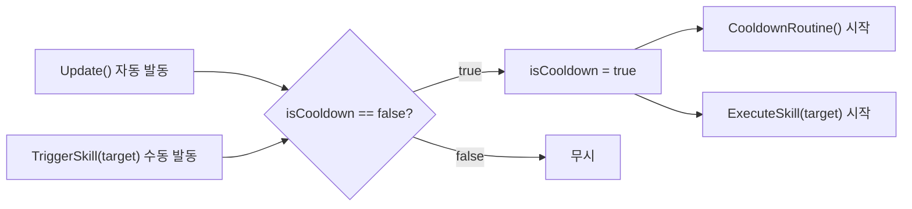

# SkillBase

**파일**: `Rock Spirit Idle/Assets/Scripts/Skills/SkillBase.cs`  
**타입**: `abstract class SkillBase : MonoBehaviour`

---

## 개요

모든 스킬 클래스의 추상 기반 클래스. 쿨다운 UI 갱신, 자동 발동 루프, 수동 발동 진입점, 가장 가까운 적 탐색을 제공한다. 서브클래스는 `ExecuteSkill`만 구현하면 된다.

---

## 필드

| 필드 | 타입 | 설명 |
|------|------|------|
| `cooldown` | `float` | 스킬 재사용 대기 시간(초) |
| `cooldownImage` | `Image` | 쿨다운 진행 표시용 UI Image (`fillAmount` 제어) |
| `cooldownText` | `Text` | 남은 쿨다운 초를 표시하는 UI Text |
| `isCooldown` | `bool` | 현재 쿨다운 중인지 여부. `true`이면 발동 불가 |
| `player` | `GameObject` (protected) | `GameManager.Instance.player.gameObject` 캐시 |

---

## 초기화

```csharp
protected virtual void Awake()
{
    cooldownImage.fillAmount = 0f;
    cooldownText.text = "";
}
protected virtual void Start()
{
    player = GameManager.Instance.player.gameObject;
}
```

`Awake`에서 쿨다운 UI를 초기 상태(비어있음)로 설정하고, `Start`에서 `GameManager` 싱글턴으로부터 플레이어 오브젝트를 가져온다.

---

## Update — 자동 발동 경로

```csharp
protected virtual void Update()
{
    if (!isCooldown)
    {
        Enemy target = FindClosestEnemy();
        if (target != null && GameManager.Instance.range.canUseSkill)
        {
            isCooldown = true;
            StartCoroutine(CooldownRoutine());
            StartCoroutine(ExecuteSkill(target));
        }
    }
}
```

매 프레임 `isCooldown`이 `false`일 때 가장 가까운 적을 탐색하여 조건이 충족되면 자동으로 스킬을 발동한다. `canUseSkill`은 `PlayerSkillRange` 컴포넌트가 관리하는 범위 조건이다.

---

## TriggerSkill — 수동 발동 경로

```csharp
public void TriggerSkill(Enemy target)
{
    if (!isCooldown)
    {
        isCooldown = true;
        StartCoroutine(CooldownRoutine());
        StartCoroutine(ExecuteSkill(target));
    }
}
```

외부에서 특정 적을 지정하여 직접 스킬을 발동할 때 사용하는 공개 진입점. `Update`의 자동 발동과 동일한 `isCooldown` 가드를 공유한다.

---

## CooldownRoutine

```csharp
protected virtual IEnumerator CooldownRoutine()
{
    float elapsed = 0f;
    cooldownImage.fillAmount = 1f;

    while (elapsed < cooldown)
    {
        elapsed += Time.deltaTime;
        cooldownImage.fillAmount = 1 - (elapsed / cooldown);
        cooldownText.text = Mathf.Ceil(cooldown - elapsed).ToString();
        yield return null;
    }

    cooldownImage.fillAmount = 0f;
    cooldownText.text = "";
    isCooldown = false;
}
```

`fillAmount` 감소 공식: `1 - (elapsed / cooldown)`

- 쿨다운 시작 시 `fillAmount = 1f` (UI가 꽉 찬 상태)
- 매 프레임 경과 비율만큼 줄어들어 0에 수렴
- `cooldownText`는 `Mathf.Ceil`로 올림 처리한 남은 시간(초)을 표시
- 루프 종료 후 `isCooldown = false`로 다음 발동을 허용

`BasicAttack`은 이 루틴을 오버라이드하여 `yield break`로 즉시 반환한다(쿨다운 UI 없음).

---

## FindClosestEnemy

```csharp
protected Enemy FindClosestEnemy()
{
    Enemy closestEnemy = null;
    float closestDistance = float.MaxValue;

    foreach (Enemy enemy in GameManager.Instance.enemies)
    {
        float distance = Vector3.Distance(player.transform.position, enemy.transform.position);
        if (distance < closestDistance)
        {
            closestDistance = distance;
            closestEnemy = enemy;
        }
    }

    return closestEnemy;
}
```

`GameManager.Instance.enemies` 리스트를 선형 순회하여 플레이어와의 3D 거리(`Vector3.Distance`)가 가장 짧은 `Enemy`를 반환한다. 적이 없으면 `null`을 반환한다.

---

## ExecuteSkill — 추상 메서드 계약

```csharp
protected abstract IEnumerator ExecuteSkill(Enemy target);
```

서브클래스가 반드시 구현해야 하는 계약. `target`은 `FindClosestEnemy` 또는 `TriggerSkill` 호출자가 제공한 적 오브젝트이다. 코루틴으로 선언되어 있으므로 서브클래스는 시간 기반 시퀀스(`yield return`)를 자유롭게 구성할 수 있다.

---

## 두 발동 경로 요약


