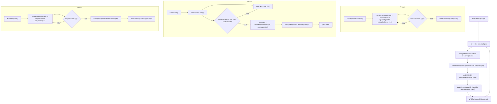

# StarLightSkill

**파일**: `Rock Spirit Idle/Assets/Scripts/Skills/StarLightSkill.cs`  
**투사체 파일**: `Rock Spirit Idle/Assets/Scripts/Skills/StarLightProjectile.cs`  
**타입**: `class StarLightSkill : SkillBase`

---

## 개요

`StarLightSkill`은 `maxStarlights`개의 투사체를 `fireInterval` 간격으로 순차 발사한다. 각 투사체는 랜덤 상향 각도로 플레이어 위쪽으로 이동한 뒤 대기하다가, 가장 가까운 적이 감지되면 해당 적을 향해 직선 이동하여 충돌 시 데미지를 적용한다.

---

## 필드

| 필드 | 타입 | 기본값 | 설명 |
|------|------|--------|------|
| `starlightPrefab` | `GameObject` | Inspector 할당 | 스타라이트 투사체 프리팹 |
| `maxStarlights` | `int` | `10` | 한 번 발동에 발사하는 투사체 수 |
| `fireInterval` | `float` | `0.5f` | 투사체 발사 사이의 대기 시간(초) |
| `projectileSpeed` | `float` | `5f` | 목표를 향한 이동 속도 |
| `upwardDistance` | `float` | `2f` | 플레이어 위쪽으로 이동할 거리(월드 단위) |

---

## 3단계 실행 흐름



---

## ExecuteSkill — 발사 각도 계산

```csharp
protected override IEnumerator ExecuteSkill(Enemy target)
{
    for (int i = 0; i < maxStarlights; i++)
    {
        Vector2 spawnPosition = player.transform.position;
        GameObject starlight = Instantiate(starlightPrefab, spawnPosition, Quaternion.identity);
        GameManager.Instance.starlightProjectiles.Add(starlight);

        float angle = Random.Range(55f, 110f);
        Vector2 randomDirection = new Vector2(Mathf.Cos(angle * Mathf.Deg2Rad), Mathf.Sin(angle * Mathf.Deg2Rad));
        Vector2 upwardPosition = spawnPosition + randomDirection * upwardDistance;
        StartCoroutine(MoveUpwardsAndAim(starlight, upwardPosition));

        yield return new WaitForSeconds(fireInterval);
    }
}
```

- `angle = Random.Range(55f, 110f)`: 55°~110° 범위의 각도 (대략 위쪽 방향 반원)
- `randomDirection = (Cos(angle), Sin(angle))`: 각도를 2D 방향 벡터로 변환
- `upwardPosition = spawnPosition + randomDirection * upwardDistance`: 플레이어 위쪽의 목표 도달 지점

---

## MoveUpwardsAndAim

```csharp
private IEnumerator MoveUpwardsAndAim(GameObject starlight, Vector2 upwardPosition)
{
    float upwardSpeed = projectileSpeed / 3.5f;

    while (starlight != null && (Vector2)starlight.transform.position != upwardPosition)
    {
        starlight.transform.position = Vector2.MoveTowards(starlight.transform.position, upwardPosition, upwardSpeed * Time.deltaTime);
        yield return null;
    }

    if (starlight != null)
    {
        StartCoroutine(EnemyAim(starlight));
    }
}
```

초기 상향 이동 속도 = `projectileSpeed / 3.5f`. `upwardPosition`에 도달하면 `EnemyAim` 코루틴으로 전환한다.

---

## EnemyAim

```csharp
private IEnumerator EnemyAim(GameObject starlight)
{
    while (starlight != null)
    {
        Enemy closestEnemy = FindClosestEnemy();

        if (closestEnemy != null && GameManager.Instance.range.canUseSkill)
        {
            yield return MoveProjectile(starlight, closestEnemy.transform.position);
            GameManager.Instance.starlightProjectiles.Remove(starlight);
            yield break;
        }

        yield return null;
    }
}
```

적이 없거나 범위 조건이 충족되지 않으면 매 프레임 재시도한다. 적이 감지되면 `MoveProjectile`로 전환하고 `starlightProjectiles` 리스트에서 제거한다.

---

## MoveProjectile

```csharp
private IEnumerator MoveProjectile(GameObject starlight, Vector2 targetPosition)
{
    StarLightProjectile projectileScript = starlight.gameObject.GetComponent<StarLightProjectile>();
    while (starlight != null && (Vector2)starlight.transform.position != targetPosition)
    {
        starlight.transform.position = Vector2.MoveTowards(starlight.transform.position, targetPosition, projectileSpeed * Time.deltaTime);
        yield return null;
    }

    if (starlight != null)
    {
        GameManager.Instance.starlightProjectiles.Remove(starlight);
        StartCoroutine(projectileScript.destroy(starlight));
    }
}
```

`targetPosition`은 `EnemyAim`에서 `MoveProjectile` 호출 시점의 적 위치로 고정된다. 목표 위치 도달 후 충돌 없이 끝나면 `projectileScript.destroy`로 파괴 시퀀스를 실행한다.

---

## GameManager.starlightProjectiles 등록/제거

| 시점 | 동작 |
|------|------|
| `ExecuteSkill` — 투사체 생성 직후 | `starlightProjectiles.Add(starlight)` |
| `EnemyAim` — `MoveProjectile` 반환 후 | `starlightProjectiles.Remove(starlight)` |
| `MoveProjectile` — 목표 도달 후 | `starlightProjectiles.Remove(starlight)` |
| `StarLightProjectile.OnTriggerEnter2D` — 충돌 시 | `GameManager.RemoveProjectile(gameObject)` |
| `GameManager.Restart()` | 전체 `starlightProjectiles` `Destroy` 후 `Clear()` |

---

## StarLightProjectile

**파일**: `Rock Spirit Idle/Assets/Scripts/Skills/StarLightProjectile.cs`  
**타입**: `class StarLightProjectile : MonoBehaviour`

### 필드

| 필드 | 타입 | 기본값 | 설명 |
|------|------|--------|------|
| `damageMultiplier` | `float` | `1.5f` | `GetCurrentPower()` 대비 데미지 배율 (150%) |
| `isUsed` | `bool` (private) | `false` | 첫 충돌 처리 후 중복 충돌 방지 플래그 |
| `coll` | `Collider2D` (private) | Awake 초기화 | 충돌 비활성화용 참조 |
| `anim` | `Animator` | Inspector 할당 | 폭발 애니메이션 오브젝트 |

### OnTriggerEnter2D — 데미지 계산

```csharp
private void OnTriggerEnter2D(Collider2D collision)
{
    if (isUsed) return;

    if (collision.TryGetComponent<Enemy>(out Enemy enemy))
    {
        float damage = GameManager.Instance.player.GetCurrentPower() * damageMultiplier;
        isUsed = true;
        if (GameManager.Instance.player.CriticalHit())
        {
            damage *= GameManager.Instance.player.criticalHit;
        }
        enemy.TakeDamage(damage);
        GameManager.Instance.RemoveProjectile(gameObject);
        StartCoroutine(destroy(gameObject));
    }
}
```

`isUsed`로 단일 충돌만 처리한다. 충돌 후 `GameManager.RemoveProjectile`로 리스트에서 제거하고 `destroy` 코루틴을 실행한다.

### destroy 코루틴

```csharp
public IEnumerator destroy(GameObject star)
{
    coll.enabled = false;
    anim.gameObject.SetActive(true);
    yield return new WaitForSeconds(0.3f);

    Destroy(star);
}
```

- `coll.enabled = false`: 추가 충돌 차단
- `anim.gameObject.SetActive(true)`: 폭발 애니메이션 재생
- 0.3초 대기 후 오브젝트 파괴
