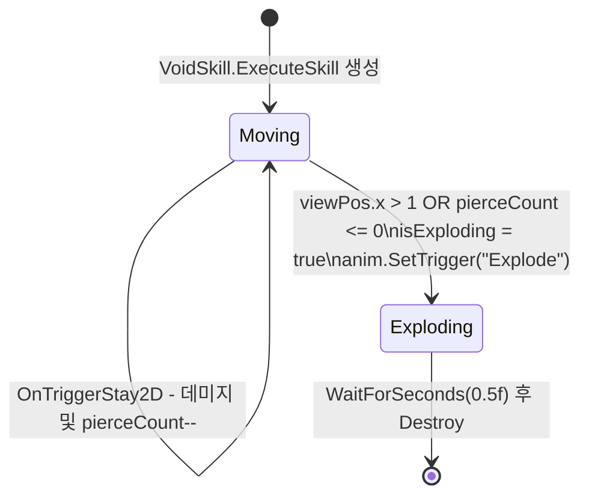

# VoidSkill

**파일**: `Rock Spirit Idle/Assets/Scripts/Skills/VoidSkill.cs`  
**투사체 파일**: `Rock Spirit Idle/Assets/Scripts/Skills/VoidProjectile.cs`  
**타입**: `class VoidSkill : SkillBase`

---

## 개요

`VoidSkill`은 플레이어 위치에 `voidPrefab`을 생성한다. 이후 모든 동작은 `VoidProjectile` 컴포넌트가 독립적으로 처리한다. `ExecuteSkill` 자체는 단일 프레임 지연(`yield return null`) 후 종료된다.

---

## ExecuteSkill

```csharp
protected override IEnumerator ExecuteSkill(Enemy target)
{
    Vector3 spawnPosition = player.transform.position;
    Instantiate(voidPrefab, spawnPosition, Quaternion.identity);

    yield return null;
}
```

`target` 인자는 사용하지 않는다. 플레이어 현재 위치에 보이드 오브젝트를 생성한 후 즉시 코루틴을 종료한다.

---

## VoidProjectile

**파일**: `Rock Spirit Idle/Assets/Scripts/Skills/VoidProjectile.cs`  
**타입**: `class VoidProjectile : MonoBehaviour`

### 필드

| 필드 | 타입 | 기본값 | 설명 |
|------|------|--------|------|
| `damageMultiplier` | `float` | `1.2f` | `GetCurrentPower()` 대비 데미지 배율 (120%) |
| `voidSpeed` | `float` | `1f` | 오른쪽 이동 속도 (월드 단위/초) |
| `pierceCount` | `int` | `10` | 관통 가능 횟수. 0이 되면 폭발 |
| `damageInterval` | `float` | `0.1f` | 동일 적에게 데미지를 재적용하기까지의 최소 간격(초) |
| `preDamageTime` | `float` (private) | `Time.time` (Awake) | 마지막 데미지 적용 시점 |
| `isExploding` | `bool` (private) | `false` | 폭발 상태 플래그. `true`이면 이동과 폭발 트리거 중단 |
| `anim` | `Animator` | Inspector 할당 | 폭발 애니메이션 제어 |

---

## 이동 로직 — Update

```csharp
private void Update()
{
    if (!isExploding)
    {
        transform.Translate(Vector3.right * voidSpeed * Time.deltaTime);
    }
    Vector3 viewPos = mainCamera.WorldToViewportPoint(transform.position);

    if ((viewPos.x > 1 || pierceCount <= 0) && !isExploding)
    {
        StartCoroutine(ExplodeAndDestroy());
    }
}
```

- `isExploding == false`일 때만 `transform.Translate`로 오른쪽 이동
- 화면 밖(`viewPos.x > 1`)이거나 `pierceCount <= 0`이 되면 `ExplodeAndDestroy` 시작
- `isExploding` 체크로 동일 조건에서 코루틴이 중복 시작되지 않도록 보호

---

## OnTriggerStay2D — damageInterval 쿨다운 + pierceCount 감소

```csharp
private void OnTriggerStay2D(Collider2D collision)
{
    if (preDamageTime + damageInterval > Time.time)
    {
        return;
    }
    if (collision.CompareTag("Enemy"))
    {
        float damage = GameManager.Instance.player.GetCurrentPower() * damageMultiplier;
        if (GameManager.Instance.player.CriticalHit())
        {
            damage *= GameManager.Instance.player.criticalHit;
        }
        collision.GetComponent<Enemy>().TakeDamage(damage);
        pierceCount--;
        preDamageTime = Time.time;
    }
}
```

- `preDamageTime + damageInterval > Time.time`: 마지막 데미지로부터 `damageInterval(0.1f)` 초가 지나지 않으면 조기 반환
- 데미지 적용 후 `pierceCount--` 및 `preDamageTime = Time.time` 갱신

**데미지 계산 공식**:

```
damage = player.GetCurrentPower() * damageMultiplier(1.2f)
// 치명타 발생 시:
damage *= player.criticalHit
```

`OnTriggerStay2D`는 `"Enemy"` 태그를 가진 Collider2D에 대해서만 처리한다.

---

## ExplodeAndDestroy

```csharp
private IEnumerator ExplodeAndDestroy()
{
    isExploding = true;
    anim.SetTrigger("Explode");

    yield return new WaitForSeconds(0.5f);

    Destroy(gameObject);
}
```

- `isExploding = true`: 이동과 추가 폭발 트리거 차단
- `anim.SetTrigger("Explode")`: 폭발 애니메이션 재생
- 0.5초 후 오브젝트 파괴

---

## isExploding 상태 전이



---

## 오브젝트 생명주기

```mermaid
flowchart TD
    A["VoidSkill.ExecuteSkill()"] --> B["Instantiate(voidPrefab, player.position)"]
    B --> C["VoidProjectile.Update() 시작"]
    C --> D{isExploding?}
    D -- false --> E["transform.Translate(Vector3.right * voidSpeed * deltaTime)"]
    E --> F{viewPos.x > 1 OR pierceCount <= 0?}
    F -- false --> C
    F -- true --> G["StartCoroutine(ExplodeAndDestroy())"]
    G --> H["isExploding = true"]
    H --> I["anim.SetTrigger(Explode)"]
    I --> J["WaitForSeconds(0.5f)"]
    J --> K["Destroy(gameObject)"]

    C --> L["OnTriggerStay2D - Enemy 접촉"]
    L --> M{preDamageTime + damageInterval > Time.time?}
    M -- true --> N["return 조기 종료"]
    M -- false --> O["GetCurrentPower() * damageMultiplier"]
    O --> P{CriticalHit()?}
    P -- true --> Q["damage *= criticalHit"]
    P -- false --> R["damage 그대로"]
    Q --> S["Enemy.TakeDamage(damage)"]
    R --> S
    S --> T["pierceCount--"]
    T --> U["preDamageTime = Time.time"]
```
