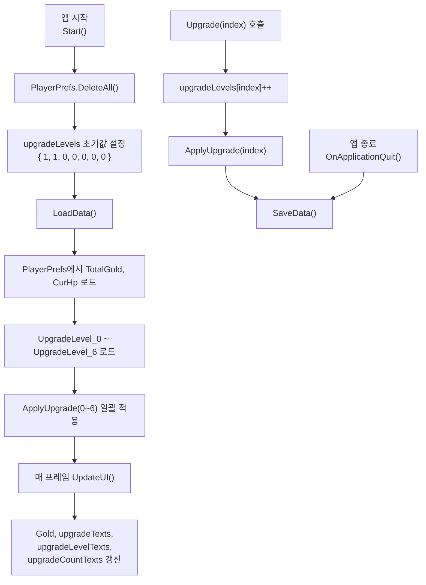

# DataManager

**파일 위치**: `Rock Spirit Idle/Assets/Scripts/Systems/DataManager.cs`

---

## 개요

`DataManager`는 `SingletonManager<DataManager>`를 상속하는 싱글턴 클래스로, PlayerPrefs를 통한 게임 데이터 영속화와 업그레이드 레벨 적용, UI 텍스트 갱신을 담당한다.

---

## 필드 목록

| 필드 | 타입 | 설명 |
|---|---|---|
| `Gold` | `Text` | 총 골드를 표시하는 UI 텍스트 |
| `upgradeTexts` | `List<Text>` | 각 업그레이드 비용을 표시하는 텍스트 목록 |
| `upgradeLevelTexts` | `List<Text>` | 각 업그레이드 레벨을 표시하는 텍스트 목록 |
| `upgradeCountTexts` | `List<Text>` | 각 업그레이드 수치(Player 필드 값)를 표시하는 텍스트 목록 |
| `upgradeLevels` | `List<int>` | 7개 업그레이드 항목의 현재 레벨 목록 |
| `totalGold` | `int` | 보유 골드 |
| `player` | `Player` | 업그레이드 적용 대상 (private) |

---

## 초기화 — upgradeLevels 초기값

`Start()`에서 `PlayerPrefs.DeleteAll()`로 저장 데이터를 초기화한 뒤 아래 초기값을 설정한다.

```csharp
private void Start()
{
    PlayerPrefs.DeleteAll();
    upgradeLevels = new List<int> { 1, 1, 0, 0, 0, 0, 0 };
    player = GameManager.Instance.player;
    LoadData();
}
```

인덱스 0(공격력)과 1(최대 HP)의 초기값이 `1`인 이유: `ApplyUpgrade`에서 `upgradeLevels[index] * 계수` 공식을 사용하므로, 초기에 최솟값 1을 보장하기 위함이다.

---

## ApplyUpgrade — 업그레이드 인덱스와 Player 필드 매핑

```csharp
private void ApplyUpgrade(int upgradeIndex)
{
    switch (upgradeIndex)
    {
        case 0: player.power = upgradeLevels[upgradeIndex] * 1f; break;
        case 1: player.maxHp = upgradeLevels[upgradeIndex] * 5f; player.hp += 5f; break;
        case 2: player.restoreHp = upgradeLevels[upgradeIndex] * 0.6f; break;
        case 3: player.criticalRate = upgradeLevels[upgradeIndex] * 1f; break;
        case 4: player.criticalHit = 1f + upgradeLevels[upgradeIndex] * 0.01f; break;
        case 5: player.attackSpeedIncrease = upgradeLevels[upgradeIndex] * 0.1f; break;
        case 6: player.doubleShot = upgradeLevels[upgradeIndex] * 1f; break;
    }
}
```

| 인덱스 | Player 필드 | 계산 공식 |
|---|---|---|
| 0 | `power` | `level × 1.0` |
| 1 | `maxHp`, `hp` | `maxHp = level × 5.0`, `hp += 5.0` |
| 2 | `restoreHp` | `level × 0.6` |
| 3 | `criticalRate` | `level × 1.0` (최대 100) |
| 4 | `criticalHit` | `1.0 + level × 0.01` |
| 5 | `attackSpeedIncrease` | `level × 0.1` |
| 6 | `doubleShot` | `level × 1.0` |

---

## Upgrade() — 업그레이드 실행

```csharp
public void Upgrade(int upgradeIndex)
{
    if (upgradeIndex >= 0 && upgradeIndex < upgradeLevels.Count)
    {
        upgradeLevels[upgradeIndex]++;
        ApplyUpgrade(upgradeIndex);
        SaveData();
    }
}
```

호출 흐름: `UIManager.UpgradeButton(index)` → 비용 검증 → `DataManager.Instance.Upgrade(index)` → `upgradeLevels[index]++` → `ApplyUpgrade` → `SaveData`.

---

## 업그레이드 버튼 비용 계산 공식

```csharp
int cost = (DataManager.Instance.upgradeLevels[index] + 1) * 10;
```

레벨이 `L`일 때 다음 업그레이드 비용은 `(L + 1) × 10` 골드.

---

## UpdateUI — upgradeCountTexts 인덱스별 표시 대상

```csharp
private void UpdateUI()
{
    Gold.text = $"{totalGold}";

    for (int i = 0; i < upgradeLevels.Count; i++)
    {
        if (i == 3 && upgradeLevels[i] == 100)
        {
            upgradeTexts[i].text = $"Max";
        }
        else
        {
            upgradeTexts[i].text = $"G {(upgradeLevels[i] + 1) * 10}";
            upgradeLevelTexts[i].text = $"Lv {upgradeLevels[i]}";
        }
    }
    upgradeCountTexts[0].text = $"{player.power}";
    upgradeCountTexts[1].text = $"{player.maxHp}";
    upgradeCountTexts[2].text = $"{player.restoreHp}";
    upgradeCountTexts[3].text = $"{player.criticalRate}%";
    upgradeCountTexts[4].text = $"{player.criticalHit * 100f}%";
    upgradeCountTexts[5].text = $"{player.attackSpeedIncrease}";
    upgradeCountTexts[6].text = $"{player.doubleShot}%";
}
```

인덱스 3(`criticalRate`)은 레벨 100에서 `upgradeTexts[3]`에 `"Max"` 문자열을 표시한다.

---

## PlayerPrefs 키 목록

### SaveData / LoadData

```csharp
private void SaveData()
{
    PlayerPrefs.SetInt("TotalGold", totalGold);
    PlayerPrefs.SetFloat("CurHp", player.hp);

    for (int i = 0; i < upgradeLevels.Count; i++)
    {
        PlayerPrefs.SetInt($"UpgradeLevel_{i}", upgradeLevels[i]);
    }

    PlayerPrefs.Save();
}

private void LoadData()
{
    totalGold = PlayerPrefs.GetInt("TotalGold", 0);
    player.hp = PlayerPrefs.GetFloat("CurHp", 0);

    for (int i = 0; i < upgradeLevels.Count; i++)
    {
        upgradeLevels[i] = PlayerPrefs.GetInt($"UpgradeLevel_{i}", upgradeLevels[i]);
    }

    for (int i = 0; i < upgradeLevels.Count; i++)
    {
        ApplyUpgrade(i);
    }
}
```

| PlayerPrefs 키 | 타입 | 기본값 |
|---|---|---|
| `TotalGold` | `int` | `0` |
| `CurHp` | `float` | `0` |
| `UpgradeLevel_0` ~ `UpgradeLevel_6` | `int` | `upgradeLevels[i]` 초기값 |

### SaveSkillData / LoadSkillData

```csharp
public void SaveSkillData(SkillUnlockSystem.SkillData skillData)
{
    PlayerPrefs.SetInt($"SkillUnlocked_{skillData.skillType}", skillData.isUnlocked ? 1 : 0);
    PlayerPrefs.Save();
}

public bool LoadSkillData(SkillUnlockSystem.SkillData skillData)
{
    return PlayerPrefs.GetInt($"SkillUnlocked_{skillData.skillType}", 0) == 1;
}
```

| PlayerPrefs 키 | 타입 | 기본값 |
|---|---|---|
| `SkillUnlocked_{skillType}` | `int` (0/1) | `0` (잠금) |

`skillType`은 `SkillType` enum 값의 문자열 표현이다(예: `SkillUnlocked_스타라이트`).

---

## 데이터 흐름


