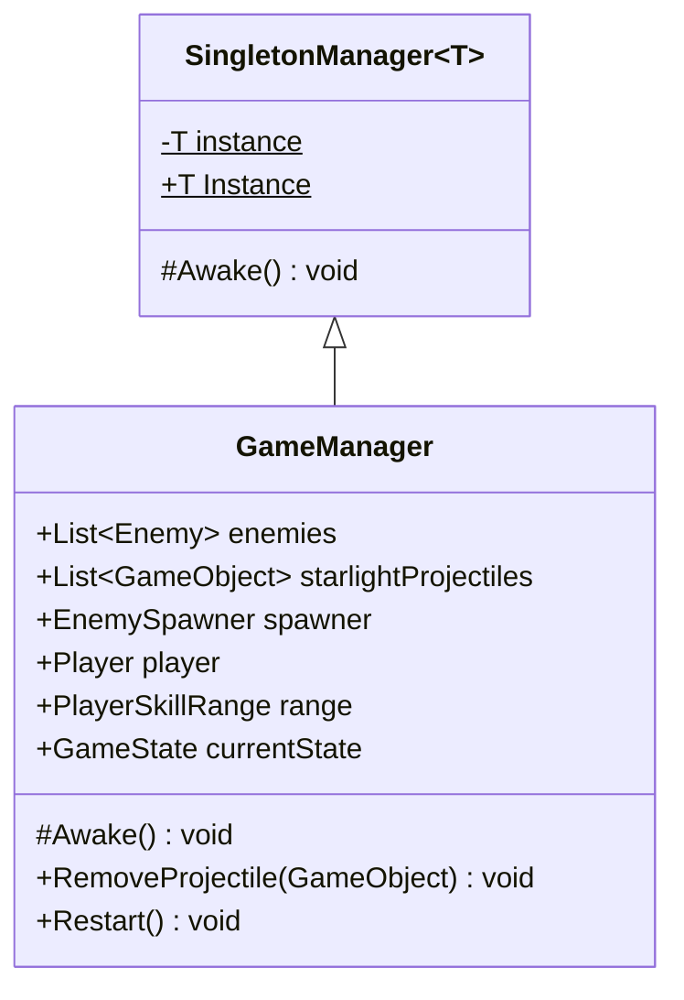
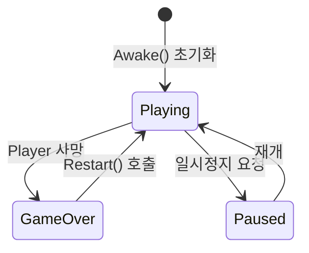
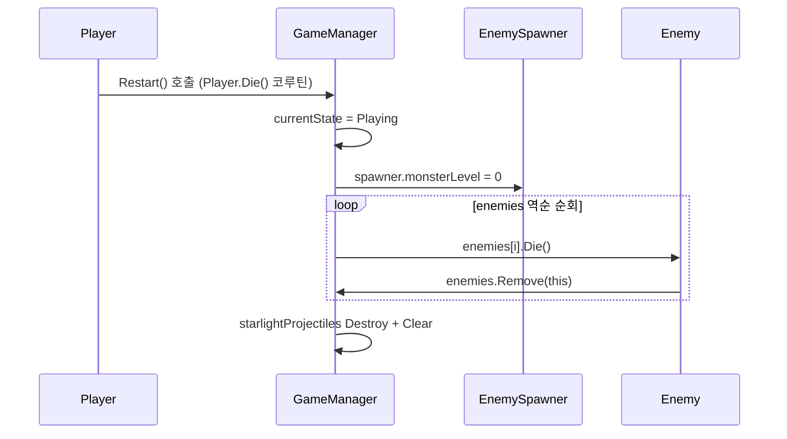

# GameManager

**파일 위치**: `Rock Spirit Idle/Assets/Scripts/Systems/GameManager.cs`

---

## 개요

`GameManager`는 `SingletonManager<GameManager>`를 상속하는 싱글턴 클래스로, 게임 내 공유 오브젝트 레퍼런스와 게임 상태(`GameState`)를 보관한다.  
모든 다른 시스템과 도메인 코드가 `GameManager.Instance`를 통해 공유 레퍼런스에 접근한다.

---

## 상속 계층



---

## 공유 상태 필드

| 필드 | 타입 | 접근 수준 | 설명 |
|---|---|---|---|
| `enemies` | `List<Enemy>` | `internal` | 현재 씬에 존재하는 모든 Enemy 오브젝트 목록 |
| `starlightProjectiles` | `List<GameObject>` | `public` | 활성 투사체 오브젝트 목록 |
| `spawner` | `EnemySpawner` | `internal` | 몬스터 스포너 레퍼런스 |
| `player` | `Player` | `internal` | 플레이어 컴포넌트 레퍼런스 |
| `range` | `PlayerSkillRange` | `internal` | 플레이어 스킬 범위 컴포넌트 레퍼런스 |
| `currentState` | `GameState` | `public` | 현재 게임 상태 열거값 |

---

## GameState enum

```csharp
public enum GameState
{
    Playing,
    Paused,
    GameOver
}
```



---

## Awake()

`SingletonManager<GameManager>.Awake()`를 호출한 뒤 `currentState`를 `GameState.Playing`으로 초기화한다.

```csharp
protected override void Awake()
{
    base.Awake();
    currentState = GameState.Playing;
}
```

---

## Restart()

게임오버 후 재시작 시 호출된다. `monsterLevel` 리셋 → 모든 Enemy `Die()` 순회 → 투사체 목록 소멸 순서로 처리된다.

```csharp
public void Restart()
{
    currentState = GameState.Playing;

    spawner.monsterLevel = 0;

    for (int i = enemies.Count - 1; i >= 0; i--)
    {
        GameManager.Instance.enemies[i].Die();
    }

    foreach (GameObject star in starlightProjectiles)
    {
        Destroy(star);
    }
    starlightProjectiles.Clear();
}
```

- `enemies` 순회 방향이 역방향(`Count - 1` → `0`)인 이유: `Die()` 내부에서 `enemies` 목록이 수정될 수 있으므로 인덱스 오류를 방지한다.
- `starlightProjectiles`는 `Destroy` 후 `Clear()`로 목록을 비운다.

---

## RemoveProjectile()

투사체가 소멸할 때 자신을 `starlightProjectiles` 목록에서 제거하기 위해 호출한다.

```csharp
public void RemoveProjectile(GameObject projectile)
{
    if (starlightProjectiles.Contains(projectile))
    {
        starlightProjectiles.Remove(projectile);
    }
}
```

---

## Integration Points

다른 시스템/도메인에서 `GameManager.Instance`에 접근하는 패턴:

| 호출 위치 | 접근 대상 |
|---|---|
| `DataManager.Start()` | `GameManager.Instance.player` |
| `UIManager.Update()` | `GameManager.Instance.currentState`, `GameManager.Instance.player.GetCurrentPower()` |
| `Player.Die()` 코루틴 | `GameManager.Instance.Restart()` |
| `SkillUnlockSystem` (간접) | `DataManager` → `GameManager.Instance.player` 경유 |
| `Enemy` (Die 내부) | `GameManager.Instance.enemies.Remove(this)` 패턴 |
| `EnemySpawner` | `GameManager.Instance.spawner`, `GameManager.Instance.enemies.Add(...)` |


