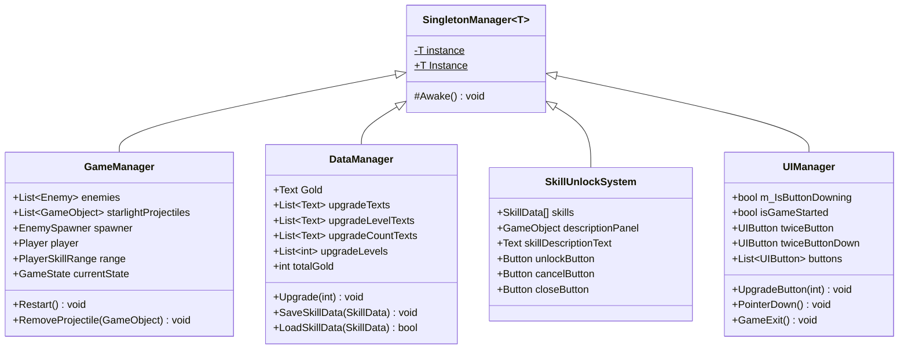
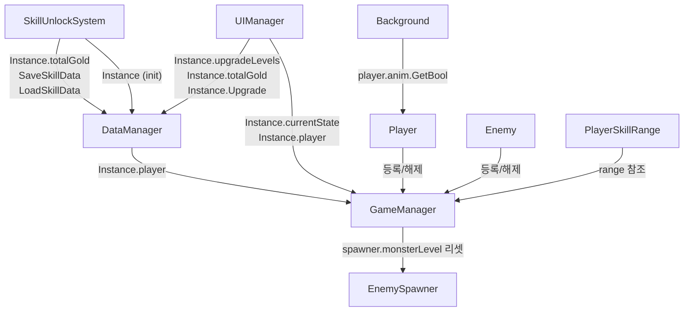
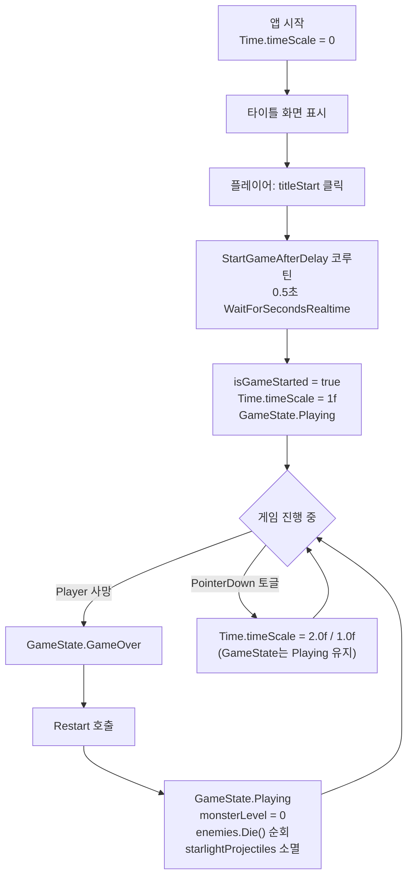

# Systems — Overview

**파일 위치**: `Rock Spirit Idle/Assets/Scripts/Systems/`

---

## Purpose

Systems 도메인은 게임 전체의 생명주기·데이터 영속화·UI 상태·스킬 잠금해제를 담당한다.  
모든 시스템 클래스는 `SingletonManager<T>`를 상속하여 씬 전환 후에도 단일 인스턴스를 유지하며, 게임 내 다른 도메인(Player, Enemy, Background 등)이 `Instance` 프로퍼티를 통해 접근하는 허브 역할을 한다.

---

## Architecture

---

## Key Components

| 클래스 | 파일 | 역할 |
|---|---|---|
| `SingletonManager<T>` | `Rock Spirit Idle/Assets/Scripts/Systems/SingletonManager.cs` | 제네릭 싱글턴 베이스. 씬 간 인스턴스 보존(`DontDestroyOnLoad`), 중복 파괴(`DestroyImmediate`) |
| `GameManager` | `Rock Spirit Idle/Assets/Scripts/Systems/GameManager.cs` | 게임 상태(`GameState`) 관리, 공유 오브젝트 레퍼런스 제공, Restart/RemoveProjectile 처리 |
| `DataManager` | `Rock Spirit Idle/Assets/Scripts/Systems/DataManager.cs` | PlayerPrefs 기반 영속화, 업그레이드 레벨 적용, UI 텍스트 갱신 |
| `SkillUnlockSystem` | `Rock Spirit Idle/Assets/Scripts/Systems/SkillUnlockSystem.cs` | 스킬 잠금해제 패널 제어, 골드 차감, DataManager 연동 저장/로드 |
| `UIManager` | `Rock Spirit Idle/Assets/Scripts/Systems/UIManager.cs` | 타이틀 화면 진입·게임 시작 전환, 2배속 토글, 업그레이드 버튼 비용 검증, 종료 패널 |
| `Background` | `Rock Spirit Idle/Assets/Scripts/Background.cs` | `MeshRenderer.material.mainTextureOffset` 스크롤 애니메이션, Player 이동 상태 동기화 |

---

## Dependencies

---

## Data Flow — 게임 상태 전환

---

## 세부 문서

각 시스템 클래스의 필드, 메서드, 코드 스니펫은 아래 개별 문서를 참조한다.

| 문서 | 대상 클래스 |
|------|------------|
| `Docs/Systems/GameManager.md` | `GameManager`, `GameState` |
| `Docs/Systems/DataManager.md` | `DataManager` |
| `Docs/Systems/SkillUnlockSystem.md` | `SkillUnlockSystem`, `SkillData`, `SkillType` |
| `Docs/Systems/UIManager.md` | `UIManager` |
