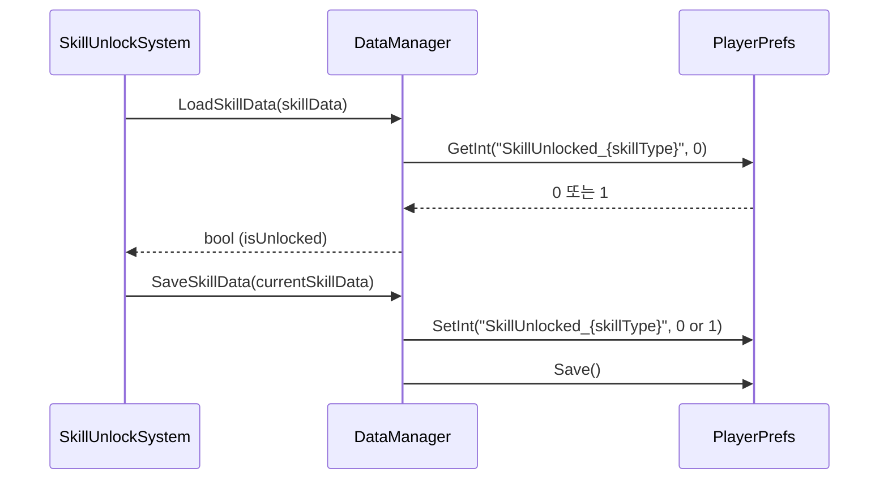
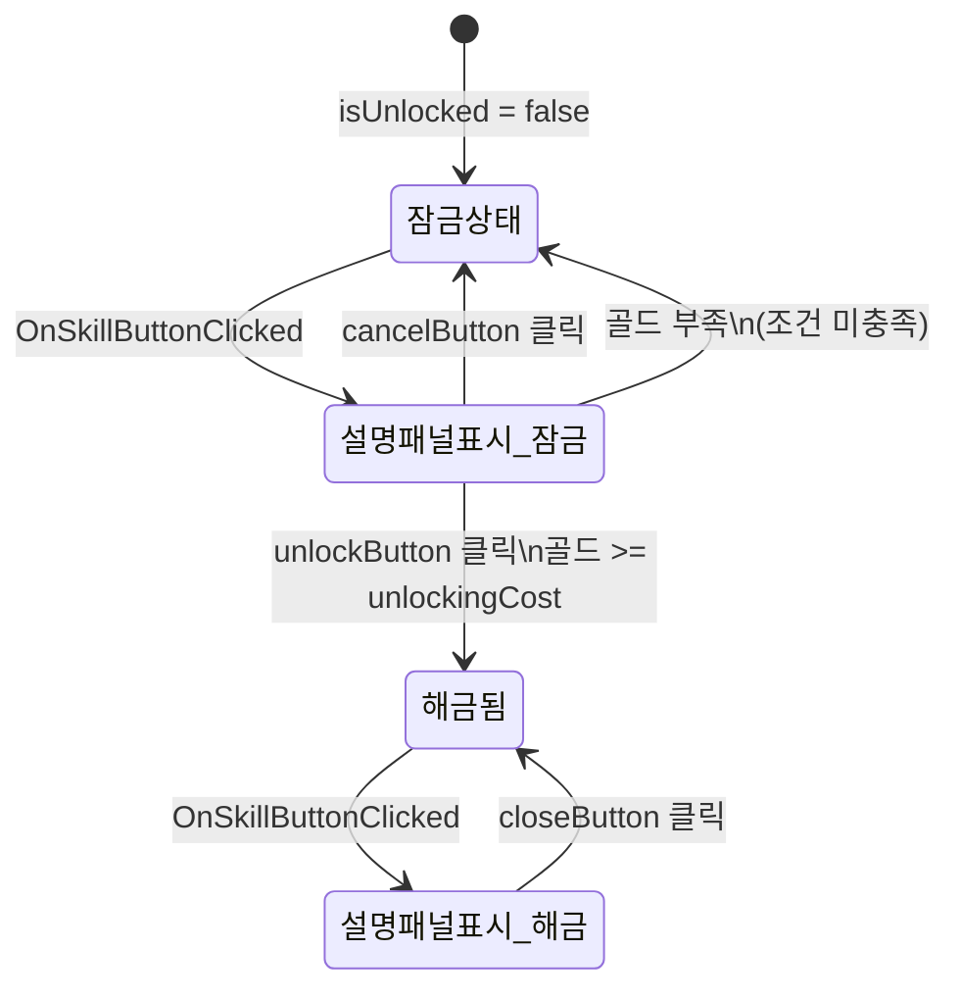

# SkillUnlockSystem

**파일 위치**: `Rock Spirit Idle/Assets/Scripts/Systems/SkillUnlockSystem.cs`

---

## 개요

`SkillUnlockSystem`은 `SingletonManager<SkillUnlockSystem>`을 상속하는 싱글턴 클래스로, 스킬 잠금해제 UI 패널의 표시·숨김, 골드 차감, 스킬 오브젝트 활성화, DataManager를 통한 저장/로드를 담당한다.

---

## SkillType enum

```csharp
public enum SkillType
{
    스타라이트,
    가이드,
    마법요정,
    분신,
    패널
}
```

---

## SkillData inner class

```csharp
[System.Serializable]
public class SkillData
{
    public SkillType skillType;            // 스킬 타입
    public GameObject skillObject;
    public Button skillButton;             // 스킬 버튼
    public Image lockImage;                // 잠금 표시 이미지
    [TextArea]
    public string description;             // 스킬 설명
    public bool isUnlocked = false;        // 스킬 해금 상태
    public int unlockingCost;
}
```

| 필드 | 타입 | 설명 |
|---|---|---|
| `skillType` | `SkillType` | 스킬 구분 enum 값 |
| `skillObject` | `GameObject` | 스킬이 해금될 때 활성화되는 게임 오브젝트 |
| `skillButton` | `Button` | 스킬 선택 버튼 |
| `lockImage` | `Image` | 잠금 상태를 나타내는 UI 이미지 |
| `description` | `string` | 스킬 설명 텍스트 (Inspector에서 TextArea로 편집) |
| `isUnlocked` | `bool` | 해금 여부. 기본값 `false` |
| `unlockingCost` | `int` | 해금에 필요한 골드 |

---

## 클래스 필드

| 필드 | 타입 | 설명 |
|---|---|---|
| `skills` | `SkillData[]` | 모든 스킬 데이터 배열 |
| `descriptionPanel` | `GameObject` | 설명 창 패널 |
| `skillDescriptionText` | `Text` | 스킬 설명 텍스트 |
| `unlockButton` | `Button` | 해금 버튼 |
| `cancelButton` | `Button` | 해금 취소 버튼 |
| `closeButton` | `Button` | 설명창 닫기 버튼 |
| `currentSkillData` | `SkillData` | 현재 선택된 스킬 데이터 (private) |

---

## Start() 초기화

```csharp
private void Start()
{
    foreach (SkillData skillData in skills)
    {
        skillData.isUnlocked = DataManager.Instance.LoadSkillData(skillData);

        skillData.lockImage.gameObject.SetActive(!skillData.isUnlocked);
        skillData.skillButton.onClick.AddListener(() => OnSkillButtonClicked(skillData));

        if (skillData.skillObject != null)
        {
            skillData.skillObject.SetActive(skillData.isUnlocked);
        }
    }

    descriptionPanel.SetActive(false);
    closeButton.gameObject.SetActive(false);
    unlockButton.onClick.AddListener(OnUnlockButtonClicked);
    cancelButton.onClick.AddListener(OnCancelButtonClicked);
    closeButton.onClick.AddListener(OnCloseButtonClicked);
}
```

---

## OnSkillButtonClicked — isUnlocked 분기 로직

```csharp
private void OnSkillButtonClicked(SkillData skillData)
{
    currentSkillData = skillData;

    if (!skillData.isUnlocked)
    {
        descriptionPanel.SetActive(true);
        skillDescriptionText.text = $"{skillData.skillType}\n\n {skillData.description}";
        unlockButton.gameObject.SetActive(true);
        cancelButton.gameObject.SetActive(true);
        closeButton.gameObject.SetActive(false);
    }
    else
    {
        descriptionPanel.SetActive(true);
        skillDescriptionText.text = $"{skillData.skillType}\n\n {skillData.description}";
        unlockButton.gameObject.SetActive(false);
        cancelButton.gameObject.SetActive(false);
        closeButton.gameObject.SetActive(true);
    }
}
```

| 조건 | unlockButton | cancelButton | closeButton |
|---|---|---|---|
| `isUnlocked == false` | 활성 | 활성 | 비활성 |
| `isUnlocked == true` | 비활성 | 비활성 | 활성 |

---

## OnUnlockButtonClicked — 골드 차감 + 스킬 활성화

```csharp
private void OnUnlockButtonClicked()
{
    if (DataManager.Instance.totalGold >= currentSkillData.unlockingCost && currentSkillData != null)
    {
        DataManager.Instance.totalGold -= currentSkillData.unlockingCost;
        currentSkillData.isUnlocked = true;
        currentSkillData.skillObject.SetActive(true);
        currentSkillData.lockImage.gameObject.SetActive(false);
        unlockButton.gameObject.SetActive(false);
        cancelButton.gameObject.SetActive(false);
        closeButton.gameObject.SetActive(true);
        skillDescriptionText.text = $"\n\n\n\n{currentSkillData.skillType} 스킬이 해금되었습니다!";

        DataManager.Instance.SaveSkillData(currentSkillData);
    }
}
```

해금 조건: `totalGold >= unlockingCost` AND `currentSkillData != null`.  
해금 후 처리 순서:
1. `totalGold` 차감
2. `isUnlocked = true`
3. `skillObject.SetActive(true)`
4. `lockImage` 숨김
5. 버튼 전환 (unlockButton·cancelButton 숨김, closeButton 표시)
6. `DataManager.Instance.SaveSkillData(currentSkillData)` 호출로 영속화

---

## DataManager 연동



---

## 상태 흐름


