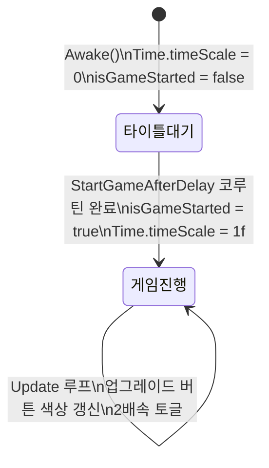
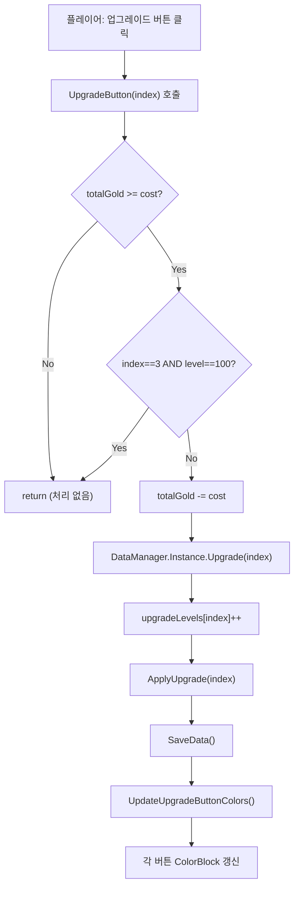

# UIManager

**파일 위치**: `Rock Spirit Idle/Assets/Scripts/Systems/UIManager.cs`

---

## 개요

`UIManager`는 `SingletonManager<UIManager>`를 상속하는 싱글턴 클래스로, 타이틀 화면 전환·2배속 토글·업그레이드 버튼 비용 검증·종료 패널을 관리한다.

---

## 필드 목록

| 필드 | 타입 | 설명 |
|---|---|---|
| `m_IsButtonDowning` | `bool` | 2배속 활성화 여부 토글 플래그 |
| `twiceButton` | `UIButton` | 1배속 상태에서 표시되는 2배속 전환 버튼 |
| `twiceButtonDown` | `UIButton` | 2배속 상태에서 표시되는 1배속 전환 버튼 |
| `buttons` | `List<UIButton>` | 7개 업그레이드 버튼 목록 |
| `isPower` | `Text` | 현재 플레이어 공격력 텍스트 |
| `title` | `Image` | 타이틀 이미지 |
| `titleStart` | `UIButton` | 게임 시작 버튼 |
| `titleQuit` | `UIButton` | 앱 종료 버튼 |
| `gameExitButton` | `UIButton` | 종료 패널 열기 버튼 |
| `gameExit` | `UIButton` | 종료 패널 내 확인 버튼 |
| `gameExitButtonclose` | `UIButton` | 종료 패널 닫기 버튼 |
| `ExitPanel` | `GameObject` | 종료 확인 패널 |
| `isGameStarted` | `bool` | 게임이 시작되었는지 여부 플래그 |

---

## isGameStarted 플래그 — 상태 전환



---

## Awake() — 타이틀 화면 초기 설정

```csharp
protected override void Awake()
{
    base.Awake();
    Time.timeScale = 0f;
    title.gameObject.SetActive(true);
    titleStart.onClick.AddListener(() => StartCoroutine(StartGameAfterDelay(0.5f)));
    titleQuit.onClick.AddListener(Application.Quit);
    ExitPanel.SetActive(false);
}
```

`Awake` 시점에 `Time.timeScale = 0f`으로 게임을 정지한 상태에서 타이틀 화면을 표시한다.

---

## StartGameAfterDelay — 타이틀 → 게임 전환 코루틴

```csharp
private IEnumerator StartGameAfterDelay(float delay)
{
    title.enabled = false;
    titleStart.gameObject.SetActive(false);
    titleQuit.gameObject.SetActive(false);
    twiceButton.gameObject.SetActive(true);
    twiceButtonDown.gameObject.SetActive(false);

    yield return new WaitForSecondsRealtime(delay);

    isGameStarted = true;
    Time.timeScale = 1f;
}
```

`WaitForSecondsRealtime`을 사용하므로 `Time.timeScale = 0` 상태에서도 `delay`(0.5초) 동안 대기한다.  
대기 완료 후 `isGameStarted = true`로 설정하고 `Time.timeScale = 1f`로 게임을 재개한다.

---

## Update() — 2배속 토글 로직

```csharp
private void Update()
{
    if (!isGameStarted) return;
    if (GameManager.Instance.currentState != GameState.Playing)
        return;

    isPower.text = $"공격력 : {GameManager.Instance.player.GetCurrentPower()}";
    UpdateUpgradeButtonColors();
    if (m_IsButtonDowning)
    {
        twiceButton.gameObject.SetActive(false);
        twiceButtonDown.gameObject.SetActive(true);
        Time.timeScale = 2.0f;
    }
    else
    {
        twiceButton.gameObject.SetActive(true);
        twiceButtonDown.gameObject.SetActive(false);
        Time.timeScale = 1.0f;
    }
}
```

`GameState.Playing`이 아닌 경우 `Update`를 조기 반환하여 2배속 토글과 버튼 색상 갱신을 중단한다.

### PointerDown() — 토글 전환

```csharp
public void PointerDown()
{
    m_IsButtonDowning = !m_IsButtonDowning;
}
```

버튼 클릭마다 `m_IsButtonDowning`을 반전시킨다. `Update()`가 매 프레임 `Time.timeScale`을 `2.0f` 또는 `1.0f`로 설정한다.

---

## UpgradeButton — 비용 검증 + DataManager.Upgrade 호출

```csharp
public void UpgradeButton(int index)
{
    int cost = (DataManager.Instance.upgradeLevels[index] + 1) * 10;
    bool isAffordable = DataManager.Instance.totalGold >= cost;

    if (!isAffordable)
    {
        return;
    }
    if (index == 3 && DataManager.Instance.upgradeLevels[index] == 100)
    {
        return;
    }
    DataManager.Instance.totalGold -= cost;
    DataManager.Instance.Upgrade(index);
    UpdateUpgradeButtonColors();
}
```

인덱스 3(`criticalRate`)은 레벨 100 도달 시 더 이상 업그레이드할 수 없다.

---

## UpdateUpgradeButtonColors / UpdateButtonColor — ColorBlock 변경

```csharp
private void UpdateUpgradeButtonColors()
{
    for (int i = 0; i < buttons.Count; i++)
    {
        int cost = (DataManager.Instance.upgradeLevels[i] + 1) * 10;
        bool isAffordable = DataManager.Instance.totalGold >= cost;
        UpdateButtonColor(buttons[i], isAffordable);
    }
}

private void UpdateButtonColor(UIButton button, bool isAffordable)
{
    ColorBlock colorBlock = button.colors;

    if (isAffordable)
    {
        colorBlock.normalColor = Color.white;
        colorBlock.highlightedColor = Color.white;
    }
    else
    {
        colorBlock.normalColor = Color.gray;
        colorBlock.highlightedColor = Color.gray;
    }

    button.colors = colorBlock;
}
```

골드가 충분하면 `Color.white`, 부족하면 `Color.gray`로 `normalColor`와 `highlightedColor`를 설정한다.

---

## GameExit — 종료 패널

```csharp
public void GameExit()
{
    ExitPanel.SetActive(true);
    gameExit.onClick.AddListener(Application.Quit);
    gameExitButtonclose.onClick.AddListener(() => { ExitPanel.SetActive(false); });
}
```

`GameExit()`가 호출될 때마다 `gameExit.onClick`에 `Application.Quit`이 추가된다.

---

## 업그레이드 버튼 처리 흐름


